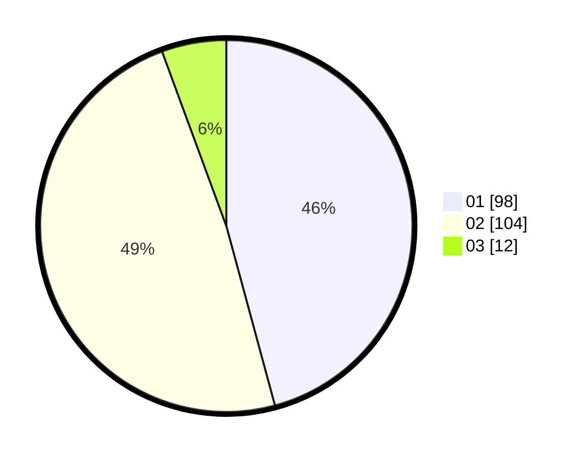

# Hasil

Hasil perolehan suara paslon dapat dilihat pada file paslon-01.txt, paslon-02.txt, dan paslon-03.txt.

Jika tidak ada, artinya data tersebut belum ada pada SIREKAP.

## Perolehan Suara

 * Paslon 01: **98**.
 * Paslon 02: **104**.
 * Paslon 03: **12**.

## Foto C Plano

https://sirekap-obj-formc.kpu.go.id/1a74/pemilu/ppwp/31/73/01/10/01/3173011001172-20240214-204811--456b3193-8ba3-49eb-a018-c17c78add30d.jpg

https://sirekap-obj-formc.kpu.go.id/1a74/pemilu/ppwp/31/73/01/10/01/3173011001172-20240214-204828--fd10a397-2e6d-4384-8413-59bff7fd4d86.jpg

https://sirekap-obj-formc.kpu.go.id/1a74/pemilu/ppwp/31/73/01/10/01/3173011001172-20240214-215140--eccccd0b-64aa-482c-8500-33519075b558.jpg
