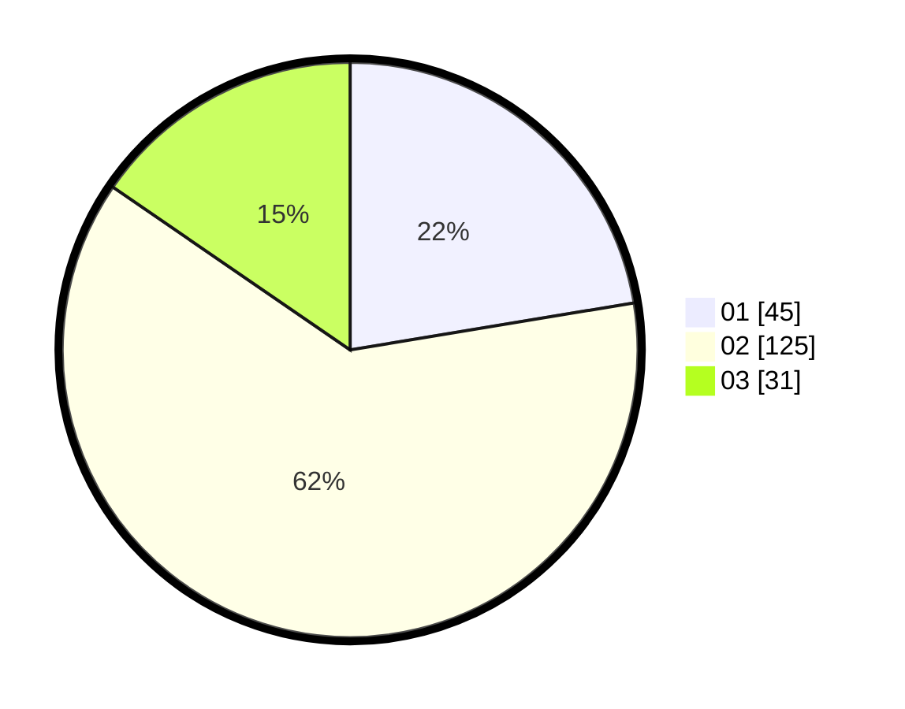

# Hasil

Hasil perolehan suara paslon dapat dilihat pada file paslon-01.txt, paslon-02.txt, dan paslon-03.txt.

Jika tidak ada, artinya data tersebut belum ada pada SIREKAP.

## Perolehan Suara

 * Paslon 01: **45**.
 * Paslon 02: **125**.
 * Paslon 03: **31**.

## Foto C Plano

https://sirekap-obj-formc.kpu.go.id/3820/pemilu/ppwp/31/73/01/10/01/3173011001179-20240214-155803--b8cf6035-78db-425f-9bcb-7965ec1f4d95.jpg

https://sirekap-obj-formc.kpu.go.id/3820/pemilu/ppwp/31/73/01/10/01/3173011001179-20240216-011641--27780885-a4d0-4dec-adad-f4a34a81926d.jpg

https://sirekap-obj-formc.kpu.go.id/3820/pemilu/ppwp/31/73/01/10/01/3173011001179-20240216-011633--ec66f03b-48df-400f-9aa4-a12bed5dd3b9.jpg

## DATA PEMILIH TETAP

Jumlah pemilih dalam DPT: **280**.
 * L: **145**.
 * P: **135**.

## DATA PENGGUNA HAK PILIH

Jumlah pengguna hak pilih dalam DPT: **201**.
 * L: **99**.
 * P: **102**.

Jumlah pengguna hak pilih dalam DPTb: **1**.
 * L: **1**.
 * P: **0**.

Jumlah pengguna hak pilih dalam DPK: **2**.
 * L: **1**.
 * P: **1**.

Jumlah pengguna hak pilih: **204**.
 * L: **101**.
 * P: **103**.

## JUMLAH SUARA SAH DAN TIDAK SAH

JUMLAH SELURUH SUARA SAH: **201**.

JUMLAH SUARA TIDAK SAH: **3**.

JUMLAH SELURUH SUARA SAH DAN SUARA TIDAK SAH: **204**.
