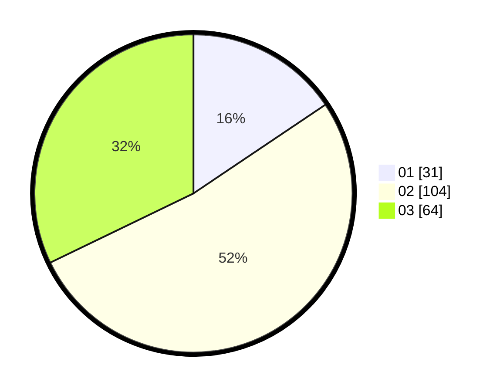

# Hasil

Hasil perolehan suara paslon dapat dilihat pada file paslon-01.txt, paslon-02.txt, dan paslon-03.txt.

Jika tidak ada, artinya data tersebut belum ada pada SIREKAP.

## Perolehan Suara

 * Paslon 01: **31**.
 * Paslon 02: **104**.
 * Paslon 03: **64**.

## Foto C Plano

https://sirekap-obj-formc.kpu.go.id/1eef/pemilu/ppwp/31/73/01/10/01/3173011001182-20240216-150415--0c9edcd6-65d7-4cf8-9732-2f6bb01bc7ea.jpg

https://sirekap-obj-formc.kpu.go.id/1eef/pemilu/ppwp/31/73/01/10/01/3173011001182-20240216-150416--ebfe7a31-7c71-46cd-b687-a2f111befbbb.jpg

https://sirekap-obj-formc.kpu.go.id/1eef/pemilu/ppwp/31/73/01/10/01/3173011001182-20240216-150416--24f388ce-4670-4aeb-807f-ee78e96dd96b.jpg

## DATA PEMILIH TETAP

Jumlah pemilih dalam DPT: **246**.
 * L: **117**.
 * P: **129**.

## DATA PENGGUNA HAK PILIH

Jumlah pengguna hak pilih dalam DPT: **202**.
 * L: **92**.
 * P: **110**.

Jumlah pengguna hak pilih dalam DPTb: **0**.
 * L: **0**.
 * P: **0**.

Jumlah pengguna hak pilih dalam DPK: **0**.
 * L: **0**.
 * P: **0**.

Jumlah pengguna hak pilih: **202**.
 * L: **92**.
 * P: **110**.

## JUMLAH SUARA SAH DAN TIDAK SAH

JUMLAH SELURUH SUARA SAH: **199**.

JUMLAH SUARA TIDAK SAH: **3**.

JUMLAH SELURUH SUARA SAH DAN SUARA TIDAK SAH: **202**.
