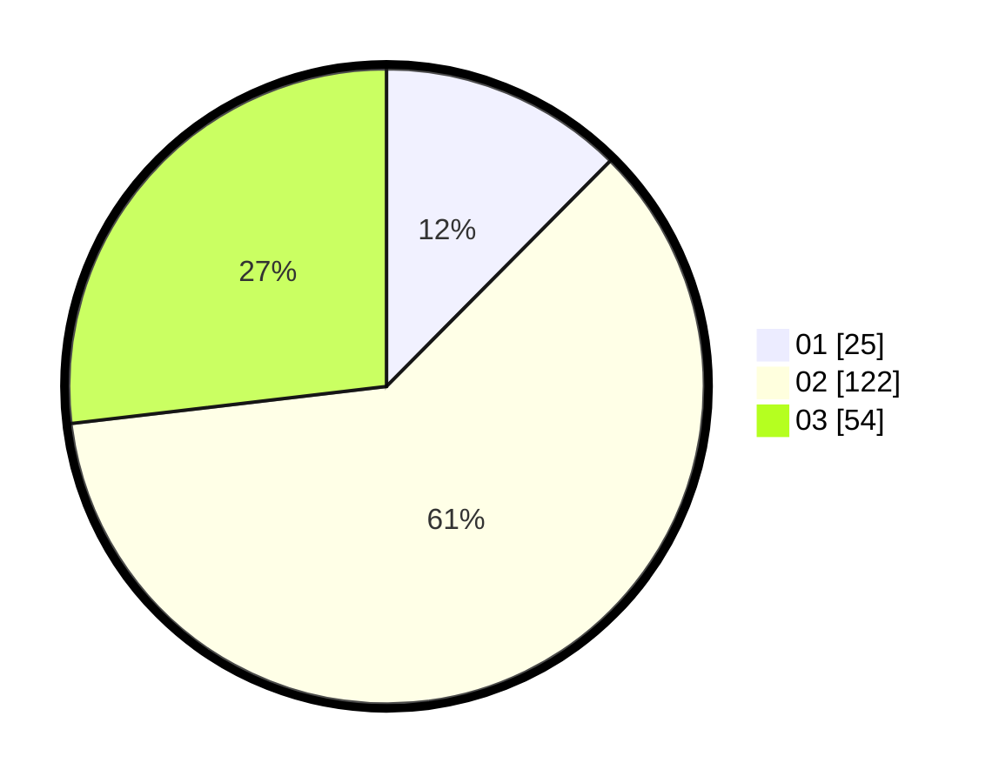

# Hasil

Hasil perolehan suara paslon dapat dilihat pada file paslon-01.txt, paslon-02.txt, dan paslon-03.txt.

Jika tidak ada, artinya data tersebut belum ada pada SIREKAP.

## Perolehan Suara

 * Paslon 01: **25**.
 * Paslon 02: **122**.
 * Paslon 03: **54**.

## Foto C Plano

https://sirekap-obj-formc.kpu.go.id/1783/pemilu/ppwp/31/73/01/10/01/3173011001184-20240214-212905--a5b66376-f614-42e5-acbe-1899e3178bcc.jpg

https://sirekap-obj-formc.kpu.go.id/1783/pemilu/ppwp/31/73/01/10/01/3173011001184-20240216-143854--35efcb04-1377-4dc9-872b-2fe25a440740.jpg

https://sirekap-obj-formc.kpu.go.id/1783/pemilu/ppwp/31/73/01/10/01/3173011001184-20240216-143854--b8507a6b-6c3d-4a46-90ac-e4689ec8a9a0.jpg

## DATA PEMILIH TETAP

Jumlah pemilih dalam DPT: **240**.
 * L: **114**.
 * P: **126**.

## DATA PENGGUNA HAK PILIH

Jumlah pengguna hak pilih dalam DPT: **206**.
 * L: **93**.
 * P: **113**.

Jumlah pengguna hak pilih dalam DPTb: **2**.
 * L: **0**.
 * P: **2**.

Jumlah pengguna hak pilih dalam DPK: **0**.
 * L: **0**.
 * P: **0**.

Jumlah pengguna hak pilih: **208**.
 * L: **93**.
 * P: **115**.

## JUMLAH SUARA SAH DAN TIDAK SAH

JUMLAH SELURUH SUARA SAH: **201**.

JUMLAH SUARA TIDAK SAH: **7**.

JUMLAH SELURUH SUARA SAH DAN SUARA TIDAK SAH: **208**.
