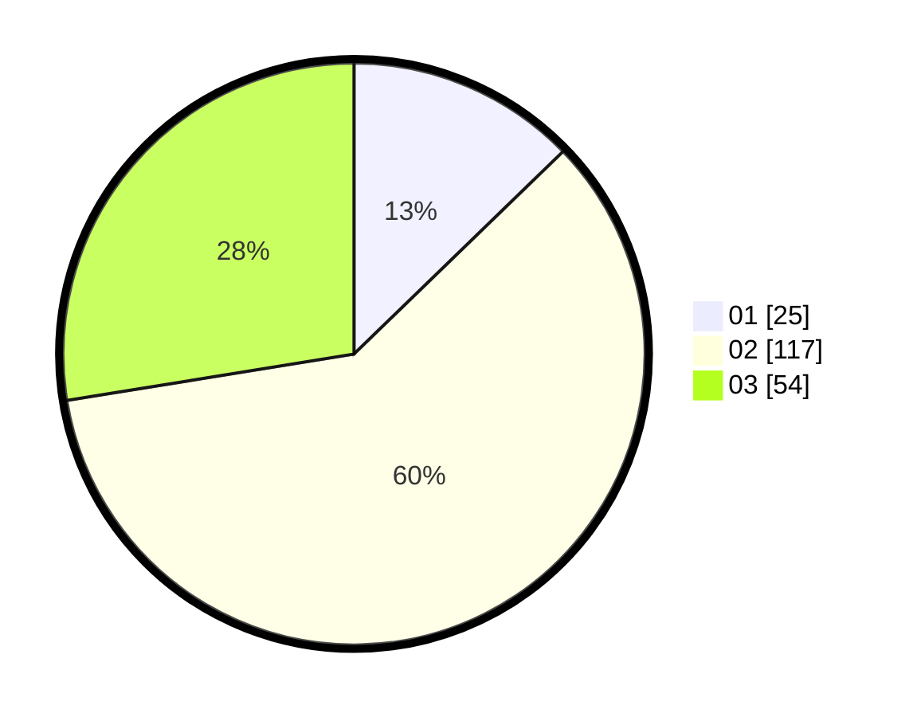

# Hasil

Hasil perolehan suara paslon dapat dilihat pada file paslon-01.txt, paslon-02.txt, dan paslon-03.txt.

Jika tidak ada, artinya data tersebut belum ada pada SIREKAP.

## Perolehan Suara

 * Paslon 01: **25**.
 * Paslon 02: **117**.
 * Paslon 03: **54**.

## Foto C Plano

https://sirekap-obj-formc.kpu.go.id/6b5a/pemilu/ppwp/31/73/01/10/01/3173011001185-20240216-134655--a39aa991-4918-4d5c-9ffb-9ada4030016a.jpg

https://sirekap-obj-formc.kpu.go.id/6b5a/pemilu/ppwp/31/73/01/10/01/3173011001185-20240214-223901--7672bf48-d7f0-4e5f-9ee0-5f6d9abc7df3.jpg

https://sirekap-obj-formc.kpu.go.id/6b5a/pemilu/ppwp/31/73/01/10/01/3173011001185-20240214-155304--a02a165c-1738-445b-bafa-1b532fe8e520.jpg

## DATA PEMILIH TETAP

Jumlah pemilih dalam DPT: **249**.
 * L: **122**.
 * P: **127**.

## DATA PENGGUNA HAK PILIH

Jumlah pengguna hak pilih dalam DPT: **208**.
 * L: **100**.
 * P: **108**.

Jumlah pengguna hak pilih dalam DPTb: **0**.
 * L: **0**.
 * P: **0**.

Jumlah pengguna hak pilih dalam DPK: **2**.
 * L: **1**.
 * P: **1**.

Jumlah pengguna hak pilih: **210**.
 * L: **101**.
 * P: **109**.

## JUMLAH SUARA SAH DAN TIDAK SAH

JUMLAH SELURUH SUARA SAH: **206**.

JUMLAH SUARA TIDAK SAH: **4**.

JUMLAH SELURUH SUARA SAH DAN SUARA TIDAK SAH: **210**.
