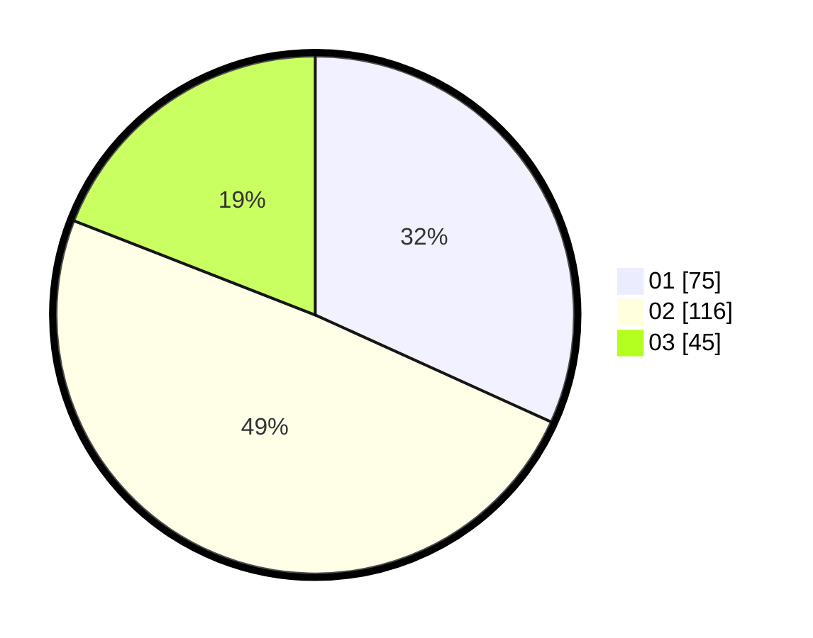

# Hasil

Hasil perolehan suara paslon dapat dilihat pada file paslon-01.txt, paslon-02.txt, dan paslon-03.txt.

Jika tidak ada, artinya data tersebut belum ada pada SIREKAP.

## Perolehan Suara

 * Paslon 01: **75**.
 * Paslon 02: **116**.
 * Paslon 03: **45**.

## Foto C Plano

https://sirekap-obj-formc.kpu.go.id/356c/pemilu/ppwp/31/73/01/10/01/3173011001190-20240214-155539--a7f07144-31d1-4d35-813c-3fcfe3e1f4c0.jpg

https://sirekap-obj-formc.kpu.go.id/356c/pemilu/ppwp/31/73/01/10/01/3173011001190-20240214-155645--84782577-fee5-4ede-b7e2-049508c3018f.jpg

https://sirekap-obj-formc.kpu.go.id/356c/pemilu/ppwp/31/73/01/10/01/3173011001190-20240214-155754--affaf912-f7ce-4174-a9bf-9226d514dcd9.jpg

## DATA PEMILIH TETAP

Jumlah pemilih dalam DPT: **268**.
 * L: **132**.
 * P: **136**.

## DATA PENGGUNA HAK PILIH

Jumlah pengguna hak pilih dalam DPT: **236**.
 * L: **117**.
 * P: **119**.

Jumlah pengguna hak pilih dalam DPTb: **1**.
 * L: **1**.
 * P: **0**.

Jumlah pengguna hak pilih dalam DPK: **2**.
 * L: **0**.
 * P: **2**.

Jumlah pengguna hak pilih: **239**.
 * L: **118**.
 * P: **121**.

## JUMLAH SUARA SAH DAN TIDAK SAH

JUMLAH SELURUH SUARA SAH: **236**.

JUMLAH SUARA TIDAK SAH: **3**.

JUMLAH SELURUH SUARA SAH DAN SUARA TIDAK SAH: **239**.
