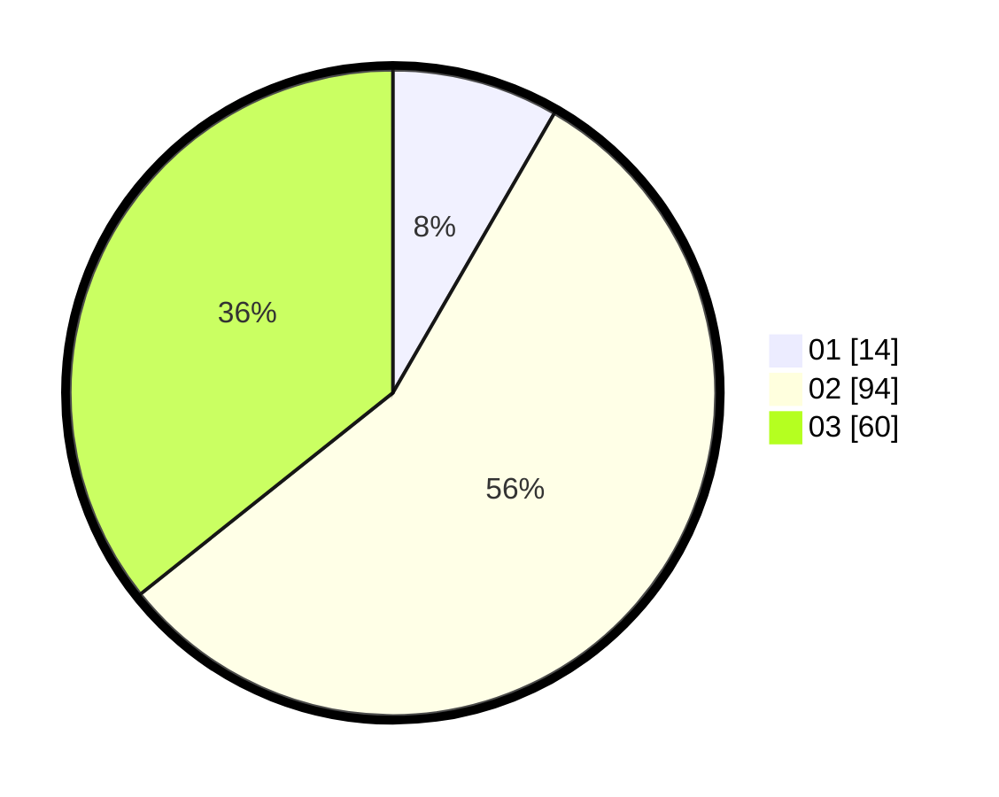

# Hasil

Hasil perolehan suara paslon dapat dilihat pada file paslon-01.txt, paslon-02.txt, dan paslon-03.txt.

Jika tidak ada, artinya data tersebut belum ada pada SIREKAP.

## Perolehan Suara

 * Paslon 01: **14**.
 * Paslon 02: **94**.
 * Paslon 03: **60**.

## Foto C Plano

https://sirekap-obj-formc.kpu.go.id/5866/pemilu/ppwp/31/73/01/10/01/3173011001195-20240214-230701--919ff7b4-73be-455b-88a6-d9156c2ff5ca.jpg

https://sirekap-obj-formc.kpu.go.id/5866/pemilu/ppwp/31/73/01/10/01/3173011001195-20240214-230817--84b5504b-63ea-458d-bcbf-70bd832f1ca8.jpg

https://sirekap-obj-formc.kpu.go.id/5866/pemilu/ppwp/31/73/01/10/01/3173011001195-20240214-230939--2b204920-703d-4a3b-9749-e97bb05a9a73.jpg
