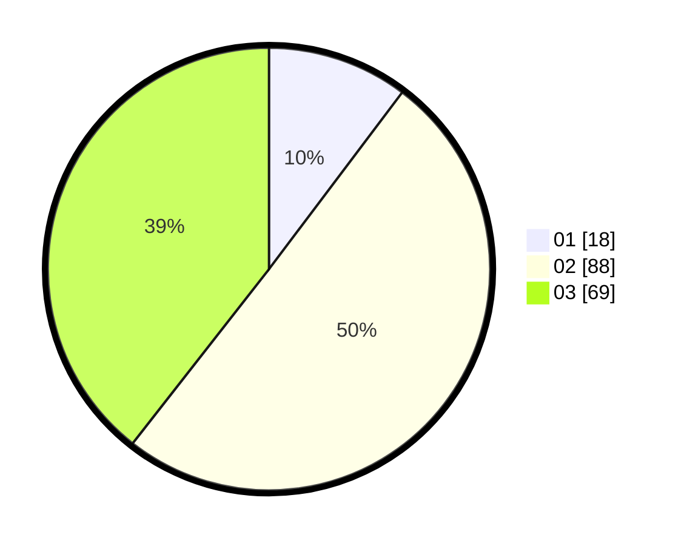

# Hasil

Hasil perolehan suara paslon dapat dilihat pada file paslon-01.txt, paslon-02.txt, dan paslon-03.txt.

Jika tidak ada, artinya data tersebut belum ada pada SIREKAP.

## Perolehan Suara

 * Paslon 01: **18**.
 * Paslon 02: **88**.
 * Paslon 03: **69**.

## Foto C Plano

https://sirekap-obj-formc.kpu.go.id/abff/pemilu/ppwp/31/73/01/10/01/3173011001196-20240214-223649--6acdf95c-c5f8-4d19-9636-66fa261b6132.jpg

https://sirekap-obj-formc.kpu.go.id/abff/pemilu/ppwp/31/73/01/10/01/3173011001196-20240214-212434--35b0df4b-29f8-4d42-991b-3e419ed21a3c.jpg

https://sirekap-obj-formc.kpu.go.id/abff/pemilu/ppwp/31/73/01/10/01/3173011001196-20240214-223959--fce07426-7cc7-4461-ae83-d04f74df98c8.jpg
