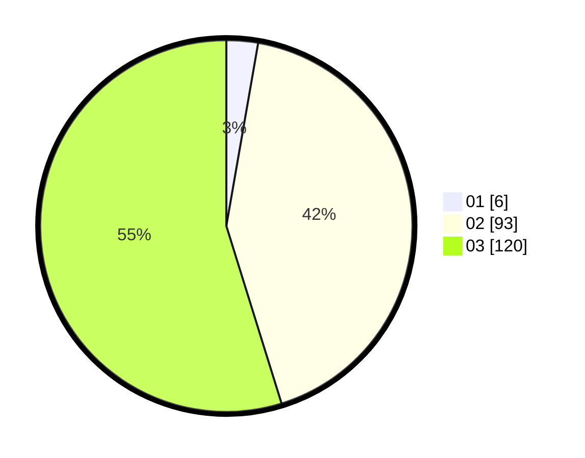

# Hasil

Hasil perolehan suara paslon dapat dilihat pada file paslon-01.txt, paslon-02.txt, dan paslon-03.txt.

Jika tidak ada, artinya data tersebut belum ada pada SIREKAP.

## Perolehan Suara

 * Paslon 01: **6**.
 * Paslon 02: **93**.
 * Paslon 03: **120**.

## Foto C Plano

https://sirekap-obj-formc.kpu.go.id/fa5f/pemilu/ppwp/31/73/01/10/01/3173011001198-20240214-224525--a6f6ab5e-2c89-4a86-9df8-ebbe59773555.jpg

https://sirekap-obj-formc.kpu.go.id/fa5f/pemilu/ppwp/31/73/01/10/01/3173011001198-20240214-224602--6b3aa159-57f4-4092-bc1b-9bace23b0bd8.jpg

https://sirekap-obj-formc.kpu.go.id/fa5f/pemilu/ppwp/31/73/01/10/01/3173011001198-20240214-224642--60312bd3-e7d5-444d-ba28-a6ed2bd1b9a1.jpg

## DATA PEMILIH TETAP

Jumlah pemilih dalam DPT: **281**.
 * L: **135**.
 * P: **146**.

## DATA PENGGUNA HAK PILIH

Jumlah pengguna hak pilih dalam DPT: **216**.
 * L: **107**.
 * P: **109**.

Jumlah pengguna hak pilih dalam DPTb: **0**.
 * L: **0**.
 * P: **0**.

Jumlah pengguna hak pilih dalam DPK: **7**.
 * L: **3**.
 * P: **4**.

Jumlah pengguna hak pilih: **223**.
 * L: **110**.
 * P: **113**.

## JUMLAH SUARA SAH DAN TIDAK SAH

JUMLAH SELURUH SUARA SAH: **219**.

JUMLAH SUARA TIDAK SAH: **4**.

JUMLAH SELURUH SUARA SAH DAN SUARA TIDAK SAH: **223**.
