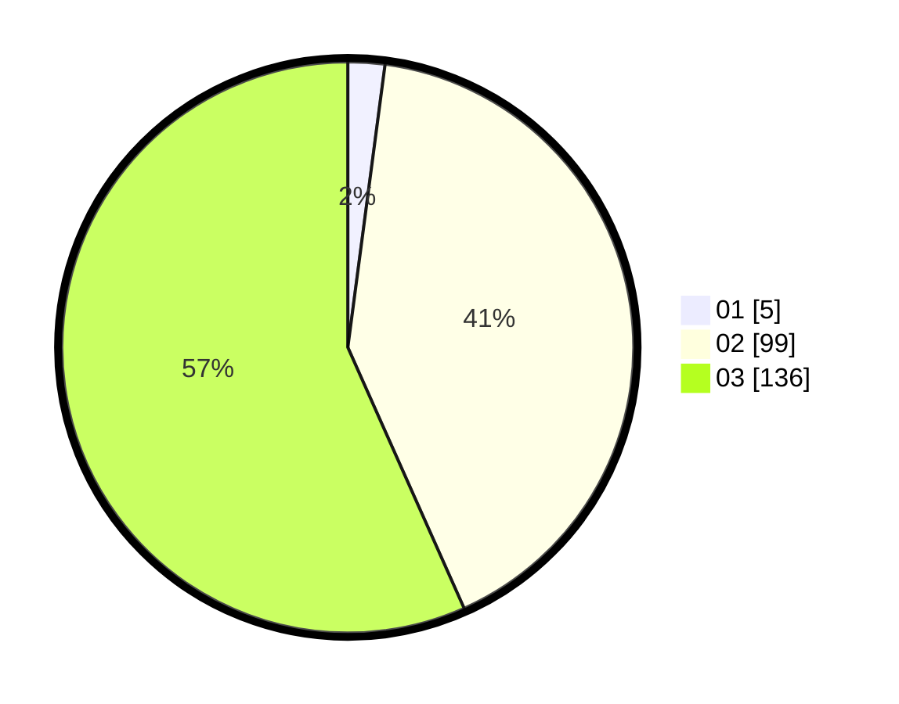

# Hasil

Hasil perolehan suara paslon dapat dilihat pada file paslon-01.txt, paslon-02.txt, dan paslon-03.txt.

Jika tidak ada, artinya data tersebut belum ada pada SIREKAP.

## Perolehan Suara

 * Paslon 01: **5**.
 * Paslon 02: **99**.
 * Paslon 03: **136**.

## Foto C Plano

https://sirekap-obj-formc.kpu.go.id/4bc7/pemilu/ppwp/31/73/01/10/01/3173011001199-20240214-230900--9214ec69-0bf0-429e-ad94-f3c05233345f.jpg

https://sirekap-obj-formc.kpu.go.id/4bc7/pemilu/ppwp/31/73/01/10/01/3173011001199-20240214-231018--739103ad-7a94-43e7-a1d8-5ed2352b360b.jpg

https://sirekap-obj-formc.kpu.go.id/4bc7/pemilu/ppwp/31/73/01/10/01/3173011001199-20240214-231112--6b0c4ff9-4a08-459c-8b2d-19a898b3021a.jpg
