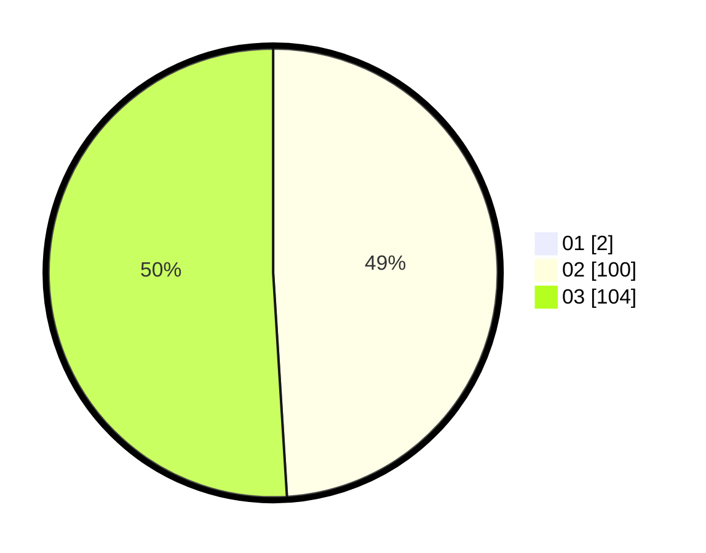

# Hasil

Hasil perolehan suara paslon dapat dilihat pada file paslon-01.txt, paslon-02.txt, dan paslon-03.txt.

Jika tidak ada, artinya data tersebut belum ada pada SIREKAP.

## Perolehan Suara

 * Paslon 01: **2**.
 * Paslon 02: **100**.
 * Paslon 03: **104**.

## Foto C Plano

https://sirekap-obj-formc.kpu.go.id/0dad/pemilu/ppwp/31/73/01/10/01/3173011001201-20240214-214720--fdf5a042-b9f3-4964-b5d5-d0d4d7d6265e.jpg

https://sirekap-obj-formc.kpu.go.id/0dad/pemilu/ppwp/31/73/01/10/01/3173011001201-20240214-214906--ed4429a9-fdd8-4d22-9b40-f8411c59cdb4.jpg

https://sirekap-obj-formc.kpu.go.id/0dad/pemilu/ppwp/31/73/01/10/01/3173011001201-20240214-215041--11f6361b-ddc0-400b-8dc4-4751e7b20347.jpg
