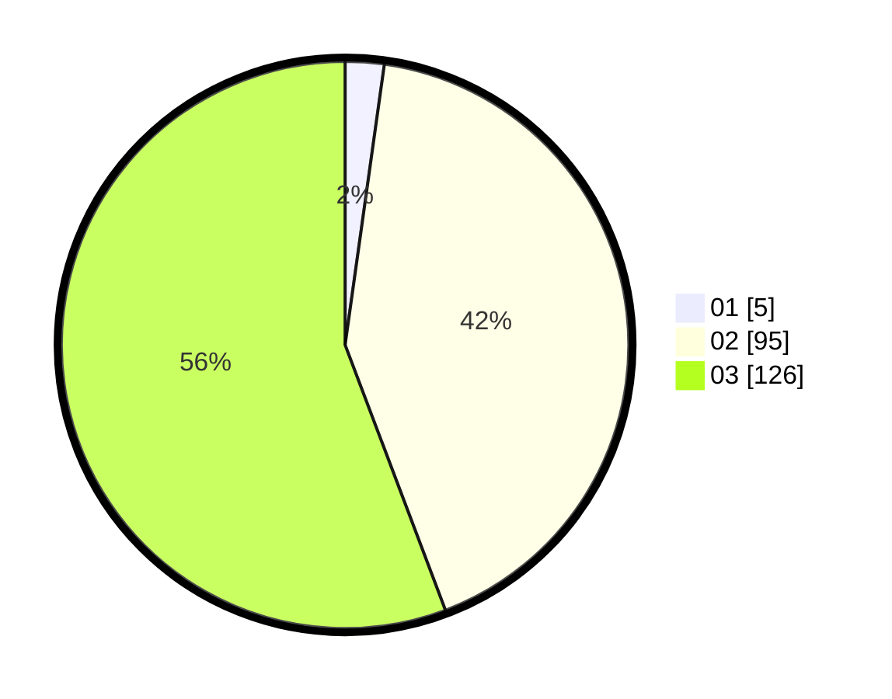

# Hasil

Hasil perolehan suara paslon dapat dilihat pada file paslon-01.txt, paslon-02.txt, dan paslon-03.txt.

Jika tidak ada, artinya data tersebut belum ada pada SIREKAP.

## Perolehan Suara

 * Paslon 01: **5**.
 * Paslon 02: **95**.
 * Paslon 03: **126**.

## Foto C Plano

https://sirekap-obj-formc.kpu.go.id/d5b3/pemilu/ppwp/31/73/01/10/01/3173011001203-20240214-184505--22bbeb14-e921-4f19-a96e-ad60facdb41a.jpg

https://sirekap-obj-formc.kpu.go.id/d5b3/pemilu/ppwp/31/73/01/10/01/3173011001203-20240214-184719--a9a01813-2c6d-4981-976f-ad13e1fb9fa9.jpg

https://sirekap-obj-formc.kpu.go.id/d5b3/pemilu/ppwp/31/73/01/10/01/3173011001203-20240214-184817--3c36a491-b4cc-493a-afe6-12546df4feab.jpg

## DATA PEMILIH TETAP

Jumlah pemilih dalam DPT: **281**.
 * L: **129**.
 * P: **152**.

## DATA PENGGUNA HAK PILIH

Jumlah pengguna hak pilih dalam DPT: **224**.
 * L: **104**.
 * P: **120**.

Jumlah pengguna hak pilih dalam DPTb: **4**.
 * L: **1**.
 * P: **3**.

Jumlah pengguna hak pilih dalam DPK: **1**.
 * L: **0**.
 * P: **1**.

Jumlah pengguna hak pilih: **229**.
 * L: **105**.
 * P: **124**.

## JUMLAH SUARA SAH DAN TIDAK SAH

JUMLAH SELURUH SUARA SAH: **226**.

JUMLAH SUARA TIDAK SAH: **3**.

JUMLAH SELURUH SUARA SAH DAN SUARA TIDAK SAH: **229**.
