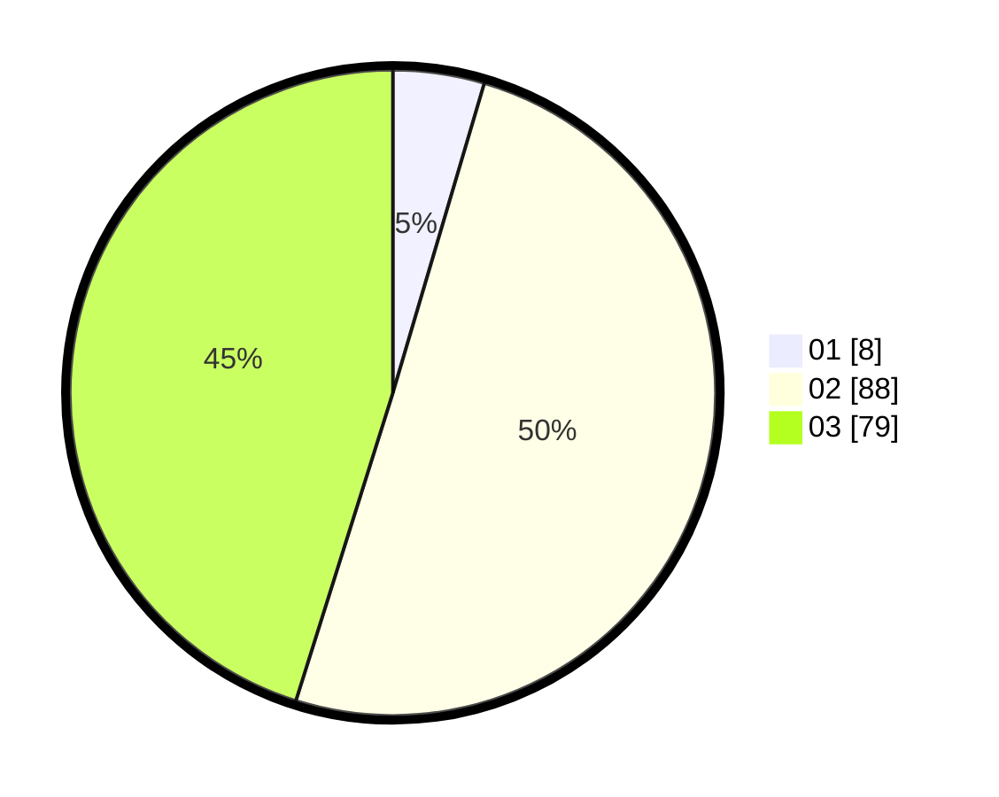

# Hasil

Hasil perolehan suara paslon dapat dilihat pada file paslon-01.txt, paslon-02.txt, dan paslon-03.txt.

Jika tidak ada, artinya data tersebut belum ada pada SIREKAP.

## Perolehan Suara

 * Paslon 01: **8**.
 * Paslon 02: **88**.
 * Paslon 03: **79**.

## Foto C Plano

https://sirekap-obj-formc.kpu.go.id/d8d5/pemilu/ppwp/31/73/01/10/01/3173011001205-20240214-210807--d349304f-5797-4a57-b52d-31fcdcdd9148.jpg

https://sirekap-obj-formc.kpu.go.id/d8d5/pemilu/ppwp/31/73/01/10/01/3173011001205-20240214-210914--dcf7fcec-d076-4cbe-8130-5cfded52ce76.jpg

https://sirekap-obj-formc.kpu.go.id/d8d5/pemilu/ppwp/31/73/01/10/01/3173011001205-20240214-211019--56aafe62-0818-474a-a38a-c7f54dc6cc75.jpg

## DATA PEMILIH TETAP

Jumlah pemilih dalam DPT: **246**.
 * L: **131**.
 * P: **115**.

## DATA PENGGUNA HAK PILIH

Jumlah pengguna hak pilih dalam DPT: **174**.
 * L: **93**.
 * P: **81**.

Jumlah pengguna hak pilih dalam DPTb: **3**.
 * L: **1**.
 * P: **2**.

Jumlah pengguna hak pilih dalam DPK: **0**.
 * L: **0**.
 * P: **0**.

Jumlah pengguna hak pilih: **177**.
 * L: **94**.
 * P: **83**.

## JUMLAH SUARA SAH DAN TIDAK SAH

JUMLAH SELURUH SUARA SAH: **175**.

JUMLAH SUARA TIDAK SAH: **3**.

JUMLAH SELURUH SUARA SAH DAN SUARA TIDAK SAH: **178**.
