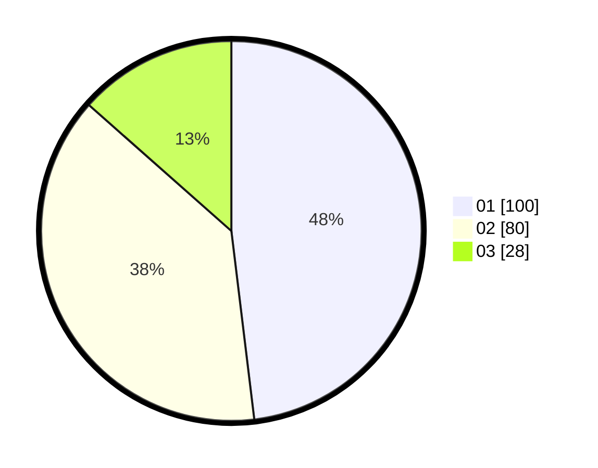

# Hasil

Hasil perolehan suara paslon dapat dilihat pada file paslon-01.txt, paslon-02.txt, dan paslon-03.txt.

Jika tidak ada, artinya data tersebut belum ada pada SIREKAP.

## Perolehan Suara

 * Paslon 01: **100**.
 * Paslon 02: **80**.
 * Paslon 03: **28**.

## Foto C Plano

https://sirekap-obj-formc.kpu.go.id/0f1e/pemilu/ppwp/31/73/01/10/01/3173011001206-20240214-200413--024b20aa-33e1-4f64-b77f-da6cdf98f45a.jpg

https://sirekap-obj-formc.kpu.go.id/0f1e/pemilu/ppwp/31/73/01/10/01/3173011001206-20240214-200421--045713a2-2b44-417f-a5f7-9942e9f4906e.jpg

https://sirekap-obj-formc.kpu.go.id/0f1e/pemilu/ppwp/31/73/01/10/01/3173011001206-20240214-200624--94ee5c79-5c0b-4e14-a967-41bc2e7a648f.jpg
