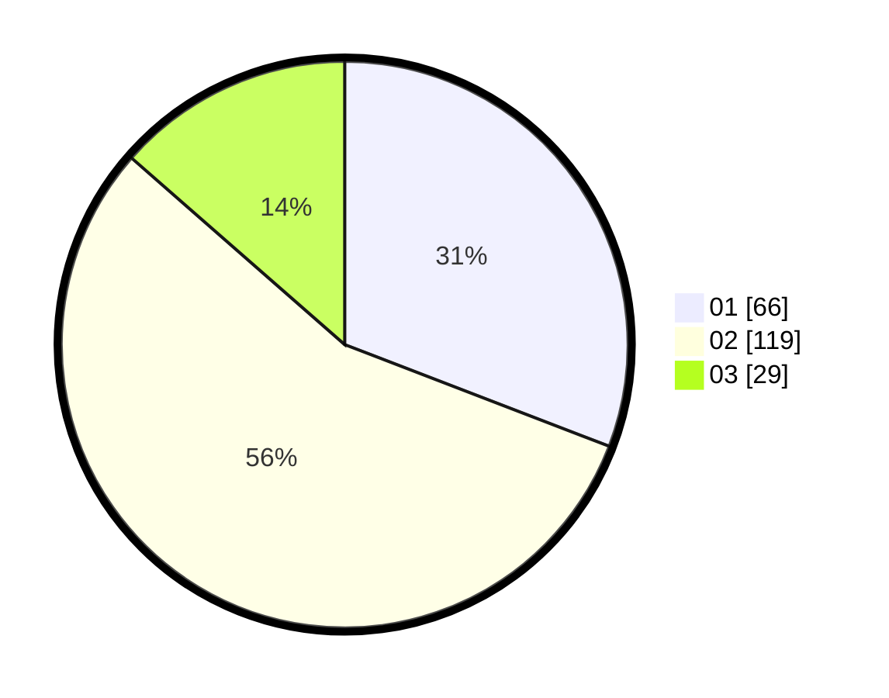

# Hasil

Hasil perolehan suara paslon dapat dilihat pada file paslon-01.txt, paslon-02.txt, dan paslon-03.txt.

Jika tidak ada, artinya data tersebut belum ada pada SIREKAP.

## Perolehan Suara

 * Paslon 01: **66**.
 * Paslon 02: **119**.
 * Paslon 03: **29**.

## Foto C Plano

https://sirekap-obj-formc.kpu.go.id/f2ab/pemilu/ppwp/31/73/01/10/01/3173011001211-20240214-221401--dcedc29b-96ed-4994-96b9-0b36b7fdbec9.jpg

https://sirekap-obj-formc.kpu.go.id/f2ab/pemilu/ppwp/31/73/01/10/01/3173011001211-20240214-210522--aa449466-6b8f-4ace-8738-7c6fd138cea0.jpg

https://sirekap-obj-formc.kpu.go.id/f2ab/pemilu/ppwp/31/73/01/10/01/3173011001211-20240214-225015--8e4f442e-a2f9-4988-85f4-d9ede09b6ce7.jpg
