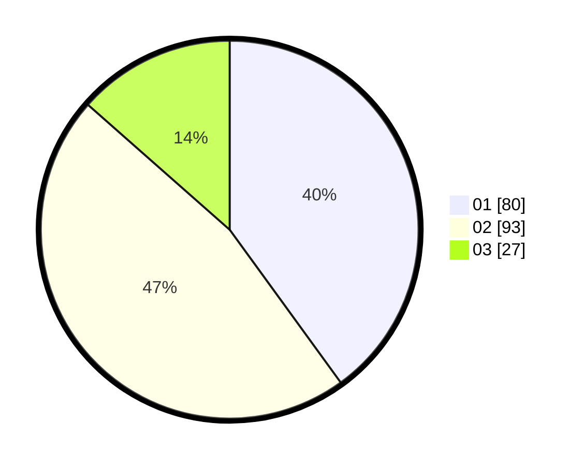

# Hasil

Hasil perolehan suara paslon dapat dilihat pada file paslon-01.txt, paslon-02.txt, dan paslon-03.txt.

Jika tidak ada, artinya data tersebut belum ada pada SIREKAP.

## Perolehan Suara

 * Paslon 01: **80**.
 * Paslon 02: **93**.
 * Paslon 03: **27**.

## Foto C Plano

https://sirekap-obj-formc.kpu.go.id/6f9a/pemilu/ppwp/31/73/01/10/01/3173011001212-20240214-195913--689fbe41-d7c2-445f-8c09-ff72dfd5342b.jpg

https://sirekap-obj-formc.kpu.go.id/6f9a/pemilu/ppwp/31/73/01/10/01/3173011001212-20240214-194422--111ec3da-62cc-4537-8582-337cf5066d70.jpg

https://sirekap-obj-formc.kpu.go.id/6f9a/pemilu/ppwp/31/73/01/10/01/3173011001212-20240214-194607--18da26d4-47fb-4098-a727-a9ad3c71d6c2.jpg

## DATA PEMILIH TETAP

Jumlah pemilih dalam DPT: **257**.
 * L: **126**.
 * P: **131**.

## DATA PENGGUNA HAK PILIH

Jumlah pengguna hak pilih dalam DPT: **206**.
 * L: **99**.
 * P: **107**.

Jumlah pengguna hak pilih dalam DPTb: **1**.
 * L: **0**.
 * P: **1**.

Jumlah pengguna hak pilih dalam DPK: **0**.
 * L: **0**.
 * P: **0**.

Jumlah pengguna hak pilih: **207**.
 * L: **99**.
 * P: **108**.

## JUMLAH SUARA SAH DAN TIDAK SAH

JUMLAH SELURUH SUARA SAH: **200**.

JUMLAH SUARA TIDAK SAH: **7**.

JUMLAH SELURUH SUARA SAH DAN SUARA TIDAK SAH: **207**.
