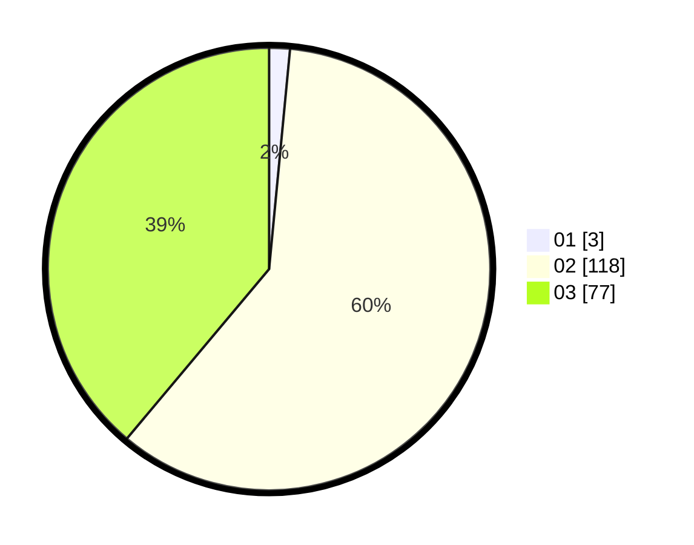

# Hasil

Hasil perolehan suara paslon dapat dilihat pada file paslon-01.txt, paslon-02.txt, dan paslon-03.txt.

Jika tidak ada, artinya data tersebut belum ada pada SIREKAP.

## Perolehan Suara

 * Paslon 01: **3**.
 * Paslon 02: **118**.
 * Paslon 03: **77**.

## Foto C Plano

https://sirekap-obj-formc.kpu.go.id/0b89/pemilu/ppwp/31/73/01/10/01/3173011001216-20240214-225135--47e6542b-ac5e-487c-a0e7-cb654fe71905.jpg

https://sirekap-obj-formc.kpu.go.id/0b89/pemilu/ppwp/31/73/01/10/01/3173011001216-20240214-225232--9f8a795a-a2e7-44f4-ab95-497546614600.jpg

https://sirekap-obj-formc.kpu.go.id/0b89/pemilu/ppwp/31/73/01/10/01/3173011001216-20240214-225306--62f6411e-aed2-4d14-b6d0-9a639f6c0c4c.jpg
