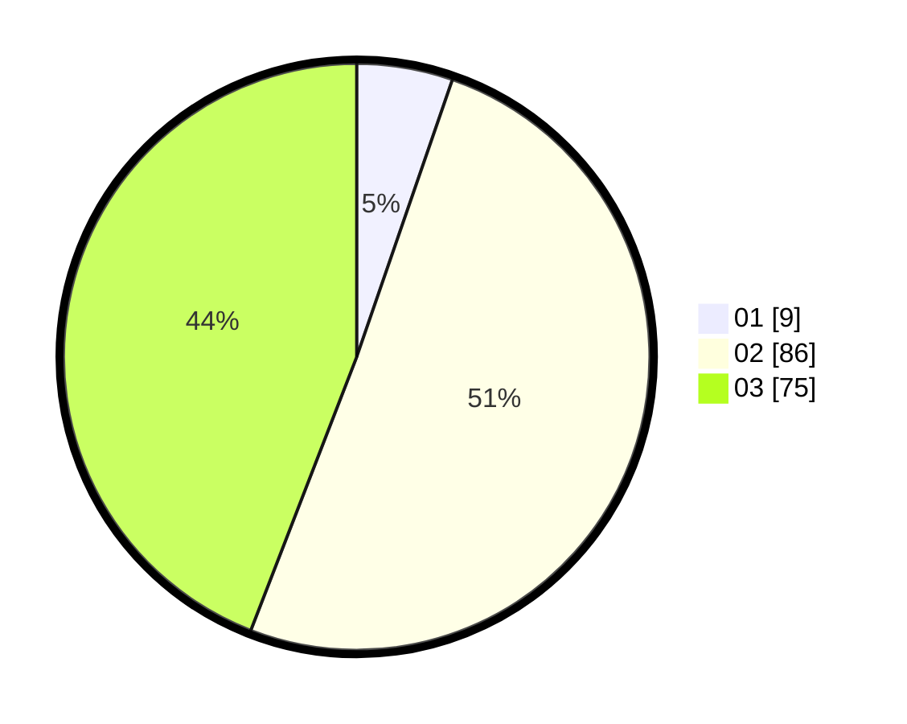

# Hasil

Hasil perolehan suara paslon dapat dilihat pada file paslon-01.txt, paslon-02.txt, dan paslon-03.txt.

Jika tidak ada, artinya data tersebut belum ada pada SIREKAP.

## Perolehan Suara

 * Paslon 01: **9**.
 * Paslon 02: **86**.
 * Paslon 03: **75**.

## Foto C Plano

https://sirekap-obj-formc.kpu.go.id/8982/pemilu/ppwp/31/73/01/10/01/3173011001219-20240214-214043--4f11cb2c-a5be-46f4-8db3-fa7e8a74a310.jpg

https://sirekap-obj-formc.kpu.go.id/8982/pemilu/ppwp/31/73/01/10/01/3173011001219-20240214-214108--9185110f-0a67-458d-8a51-b4a6475f2f1a.jpg

https://sirekap-obj-formc.kpu.go.id/8982/pemilu/ppwp/31/73/01/10/01/3173011001219-20240214-214204--67e9c4ba-638d-43ec-a9e1-d95928be410a.jpg
