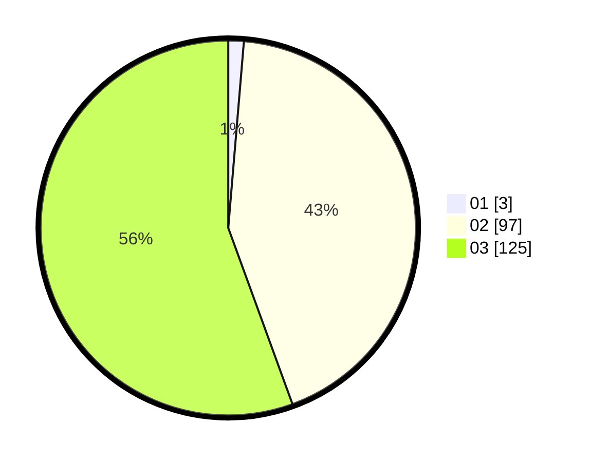

# Hasil

Hasil perolehan suara paslon dapat dilihat pada file paslon-01.txt, paslon-02.txt, dan paslon-03.txt.

Jika tidak ada, artinya data tersebut belum ada pada SIREKAP.

## Perolehan Suara

 * Paslon 01: **3**.
 * Paslon 02: **97**.
 * Paslon 03: **125**.

## Foto C Plano

https://sirekap-obj-formc.kpu.go.id/87c8/pemilu/ppwp/31/73/01/10/01/3173011001221-20240214-225019--327e94ea-b589-4715-bea8-08805938541b.jpg

https://sirekap-obj-formc.kpu.go.id/87c8/pemilu/ppwp/31/73/01/10/01/3173011001221-20240214-203506--e36c1844-bbf9-4349-a241-89854ca3ee96.jpg

https://sirekap-obj-formc.kpu.go.id/87c8/pemilu/ppwp/31/73/01/10/01/3173011001221-20240214-203513--4b80dc93-3718-4586-99e8-7c6d7e83f495.jpg
