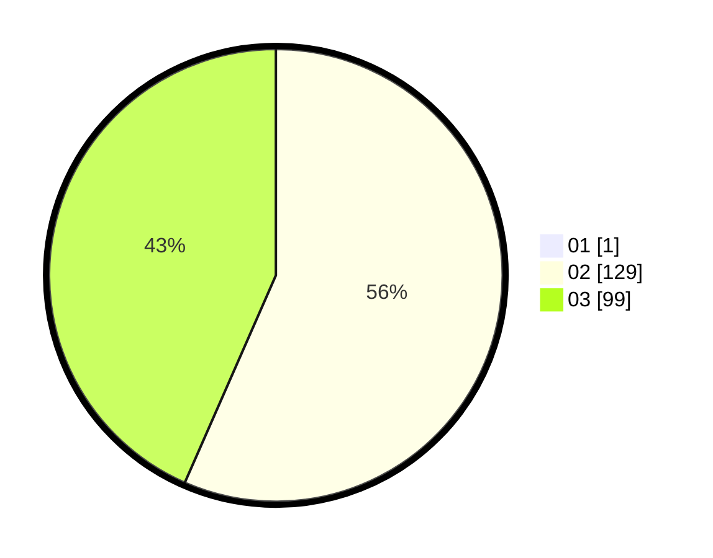

# Hasil

Hasil perolehan suara paslon dapat dilihat pada file paslon-01.txt, paslon-02.txt, dan paslon-03.txt.

Jika tidak ada, artinya data tersebut belum ada pada SIREKAP.

## Perolehan Suara

 * Paslon 01: **1**.
 * Paslon 02: **129**.
 * Paslon 03: **99**.

## Foto C Plano

https://sirekap-obj-formc.kpu.go.id/bf6e/pemilu/ppwp/31/73/01/10/01/3173011001224-20240214-220540--8565bbde-833e-468f-9942-677aed8165e3.jpg

https://sirekap-obj-formc.kpu.go.id/bf6e/pemilu/ppwp/31/73/01/10/01/3173011001224-20240214-220613--be8b0c45-90dd-498e-9c8f-eb010ea86de8.jpg

https://sirekap-obj-formc.kpu.go.id/bf6e/pemilu/ppwp/31/73/01/10/01/3173011001224-20240214-220658--041f7178-5ba2-4ec1-9b1f-51ac47056b8e.jpg
