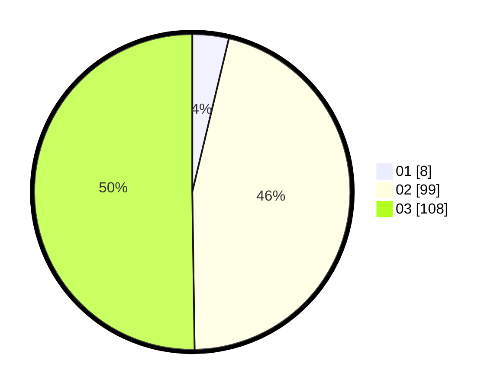

# Hasil

Hasil perolehan suara paslon dapat dilihat pada file paslon-01.txt, paslon-02.txt, dan paslon-03.txt.

Jika tidak ada, artinya data tersebut belum ada pada SIREKAP.

## Perolehan Suara

 * Paslon 01: **8**.
 * Paslon 02: **99**.
 * Paslon 03: **108**.

## Foto C Plano

https://sirekap-obj-formc.kpu.go.id/e7a6/pemilu/ppwp/31/73/01/10/01/3173011001226-20240214-222031--501758e3-4ec6-449d-8dec-40bb7b9b5d9b.jpg

https://sirekap-obj-formc.kpu.go.id/e7a6/pemilu/ppwp/31/73/01/10/01/3173011001226-20240214-222148--8ff68300-98f6-4c09-b257-de66e334b16d.jpg

https://sirekap-obj-formc.kpu.go.id/e7a6/pemilu/ppwp/31/73/01/10/01/3173011001226-20240214-222210--b13160bf-387f-498f-b2f5-939d3d0dfc73.jpg
