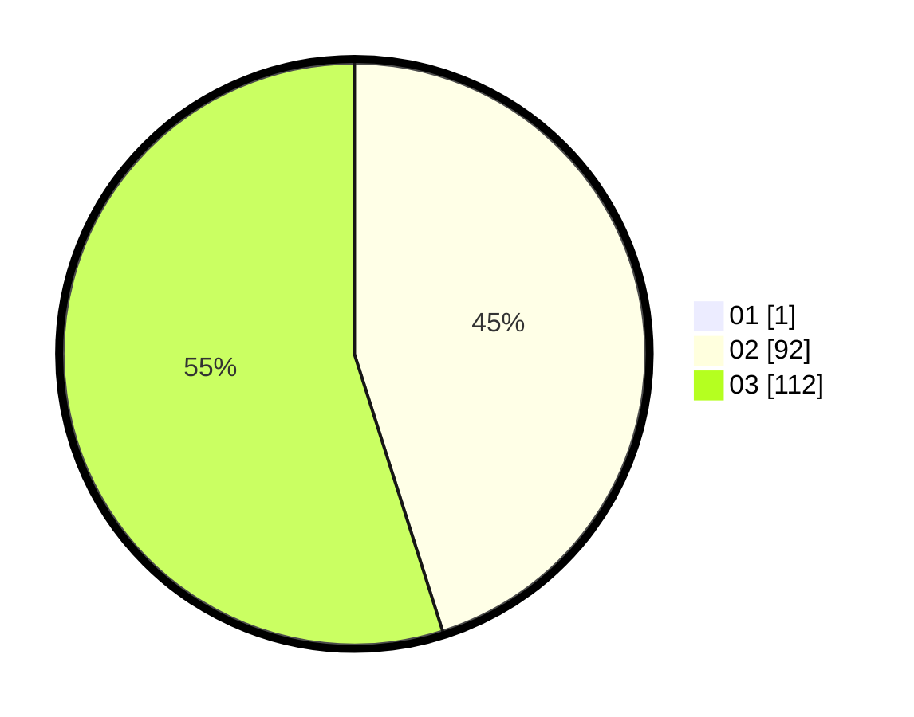

# Hasil

Hasil perolehan suara paslon dapat dilihat pada file paslon-01.txt, paslon-02.txt, dan paslon-03.txt.

Jika tidak ada, artinya data tersebut belum ada pada SIREKAP.

## Perolehan Suara

 * Paslon 01: **1**.
 * Paslon 02: **92**.
 * Paslon 03: **112**.

## Foto C Plano

https://sirekap-obj-formc.kpu.go.id/94d2/pemilu/ppwp/31/73/01/10/01/3173011001230-20240215-215855--1edd4026-07ea-4ae5-9464-dee7f3d22f88.jpg

https://sirekap-obj-formc.kpu.go.id/94d2/pemilu/ppwp/31/73/01/10/01/3173011001230-20240215-215857--d4f9cdc4-ccd1-4591-999c-6cac0b9df214.jpg

https://sirekap-obj-formc.kpu.go.id/94d2/pemilu/ppwp/31/73/01/10/01/3173011001230-20240215-215856--efb8bbc0-264b-4bae-aa01-4443fc7f5fa4.jpg

## DATA PEMILIH TETAP

Jumlah pemilih dalam DPT: **292**.
 * L: **141**.
 * P: **151**.

## DATA PENGGUNA HAK PILIH

Jumlah pengguna hak pilih dalam DPT: **205**.
 * L: **93**.
 * P: **112**.

Jumlah pengguna hak pilih dalam DPTb: **4**.
 * L: **1**.
 * P: **3**.

Jumlah pengguna hak pilih dalam DPK: **0**.
 * L: **0**.
 * P: **0**.

Jumlah pengguna hak pilih: **209**.
 * L: **94**.
 * P: **115**.

## JUMLAH SUARA SAH DAN TIDAK SAH

JUMLAH SELURUH SUARA SAH: **205**.

JUMLAH SUARA TIDAK SAH: **4**.

JUMLAH SELURUH SUARA SAH DAN SUARA TIDAK SAH: **209**.
