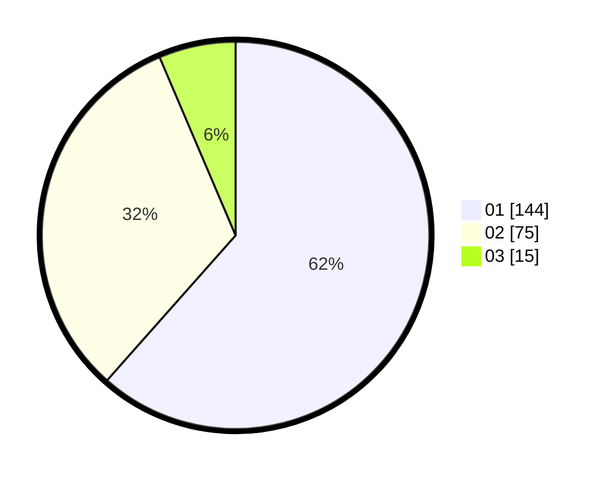

# Hasil

Hasil perolehan suara paslon dapat dilihat pada file paslon-01.txt, paslon-02.txt, dan paslon-03.txt.

Jika tidak ada, artinya data tersebut belum ada pada SIREKAP.

## Perolehan Suara

 * Paslon 01: **144**.
 * Paslon 02: **75**.
 * Paslon 03: **15**.

## Foto C Plano

https://sirekap-obj-formc.kpu.go.id/838d/pemilu/ppwp/31/73/01/10/02/3173011002001-20240214-230402--5f509b91-9bac-4c26-99bf-147dd92bf7b2.jpg

https://sirekap-obj-formc.kpu.go.id/838d/pemilu/ppwp/31/73/01/10/02/3173011002001-20240214-230518--b1d39fc9-f509-4999-a6cb-8a2816e16e32.jpg
