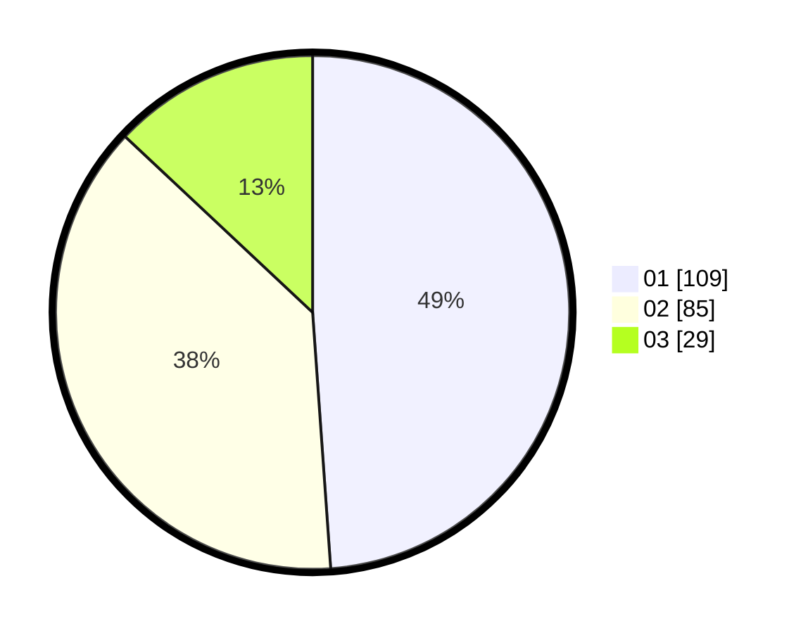

# Hasil

Hasil perolehan suara paslon dapat dilihat pada file paslon-01.txt, paslon-02.txt, dan paslon-03.txt.

Jika tidak ada, artinya data tersebut belum ada pada SIREKAP.

## Perolehan Suara

 * Paslon 01: **109**.
 * Paslon 02: **85**.
 * Paslon 03: **29**.

## Foto C Plano

https://sirekap-obj-formc.kpu.go.id/46fd/pemilu/ppwp/31/73/01/10/02/3173011002003-20240215-011644--09a0134a-e469-46e5-bef0-b8271bc16a7b.jpg

https://sirekap-obj-formc.kpu.go.id/46fd/pemilu/ppwp/31/73/01/10/02/3173011002003-20240214-215239--bbd15742-cf72-409c-b70a-b7ae3203eae9.jpg

https://sirekap-obj-formc.kpu.go.id/46fd/pemilu/ppwp/31/73/01/10/02/3173011002003-20240215-011851--04401f9d-54e9-4c11-b5be-4cbefc7e8899.jpg
