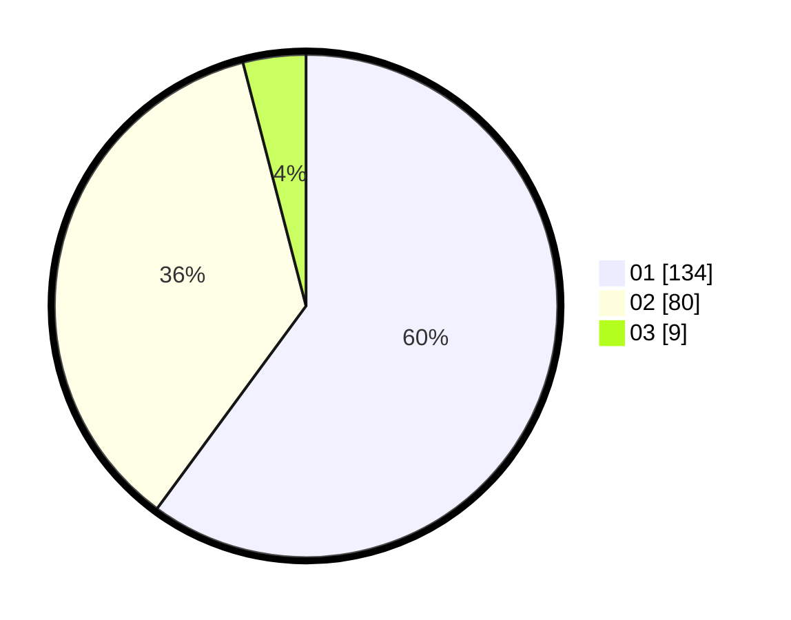

# Hasil

Hasil perolehan suara paslon dapat dilihat pada file paslon-01.txt, paslon-02.txt, dan paslon-03.txt.

Jika tidak ada, artinya data tersebut belum ada pada SIREKAP.

## Perolehan Suara

 * Paslon 01: **134**.
 * Paslon 02: **80**.
 * Paslon 03: **9**.

## Foto C Plano

https://sirekap-obj-formc.kpu.go.id/7ebd/pemilu/ppwp/31/73/01/10/02/3173011002005-20240215-000515--9d974c03-2469-46af-9a62-9680e0b7cb1e.jpg

https://sirekap-obj-formc.kpu.go.id/7ebd/pemilu/ppwp/31/73/01/10/02/3173011002005-20240215-001731--d25b4c44-a80e-4710-8861-49380af399f8.jpg

https://sirekap-obj-formc.kpu.go.id/7ebd/pemilu/ppwp/31/73/01/10/02/3173011002005-20240215-001325--761510fd-b3be-41d4-81f7-b7cb0cca0f02.jpg
