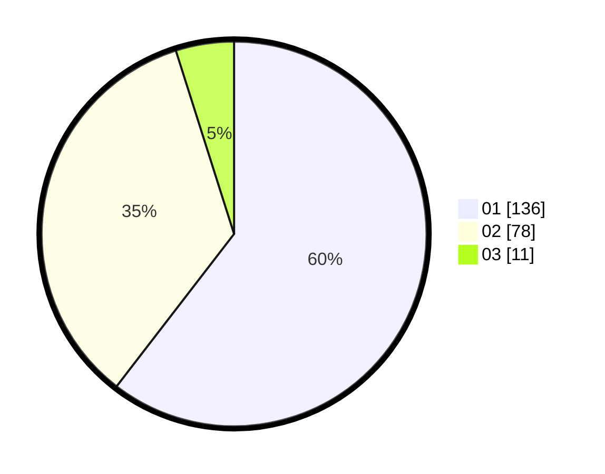

# Hasil

Hasil perolehan suara paslon dapat dilihat pada file paslon-01.txt, paslon-02.txt, dan paslon-03.txt.

Jika tidak ada, artinya data tersebut belum ada pada SIREKAP.

## Perolehan Suara

 * Paslon 01: **136**.
 * Paslon 02: **78**.
 * Paslon 03: **11**.

## Foto C Plano

https://sirekap-obj-formc.kpu.go.id/56f8/pemilu/ppwp/31/73/01/10/02/3173011002008-20240216-144146--051e7dcf-3b47-41a7-a185-15b062544f98.jpg

https://sirekap-obj-formc.kpu.go.id/56f8/pemilu/ppwp/31/73/01/10/02/3173011002008-20240216-144147--1fff311c-8617-4948-8a03-0324b124be20.jpg

https://sirekap-obj-formc.kpu.go.id/56f8/pemilu/ppwp/31/73/01/10/02/3173011002008-20240216-144146--85fb5179-fc83-4b7e-911c-a10cf27c63be.jpg

## DATA PEMILIH TETAP

Jumlah pemilih dalam DPT: **270**.
 * L: **137**.
 * P: **133**.

## DATA PENGGUNA HAK PILIH

Jumlah pengguna hak pilih dalam DPT: **220**.
 * L: **114**.
 * P: **106**.

Jumlah pengguna hak pilih dalam DPTb: **5**.
 * L: **1**.
 * P: **4**.

Jumlah pengguna hak pilih dalam DPK: **1**.
 * L: **1**.
 * P: **0**.

Jumlah pengguna hak pilih: **226**.
 * L: **116**.
 * P: **110**.

## JUMLAH SUARA SAH DAN TIDAK SAH

JUMLAH SELURUH SUARA SAH: **225**.

JUMLAH SUARA TIDAK SAH: **1**.

JUMLAH SELURUH SUARA SAH DAN SUARA TIDAK SAH: **226**.
