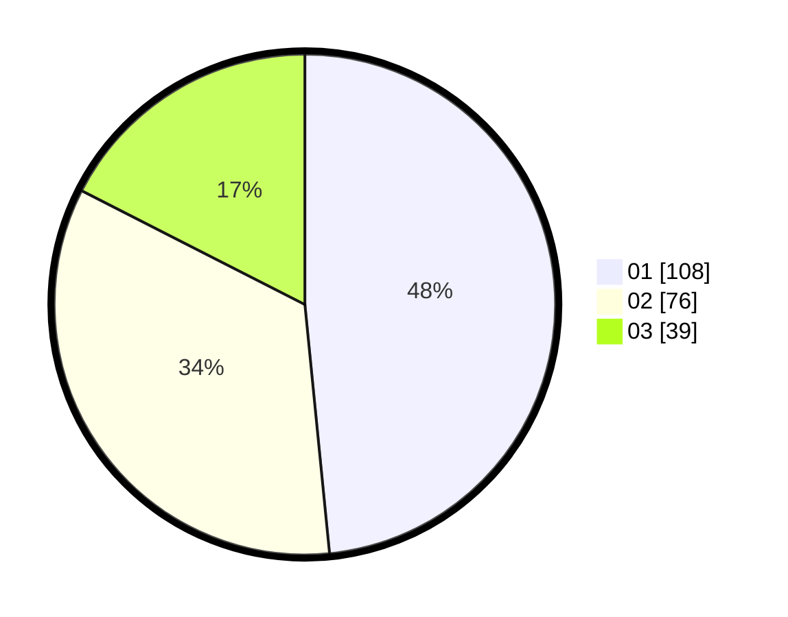

# Hasil

Hasil perolehan suara paslon dapat dilihat pada file paslon-01.txt, paslon-02.txt, dan paslon-03.txt.

Jika tidak ada, artinya data tersebut belum ada pada SIREKAP.

## Perolehan Suara

 * Paslon 01: **108**.
 * Paslon 02: **76**.
 * Paslon 03: **39**.

## Foto C Plano

https://sirekap-obj-formc.kpu.go.id/469d/pemilu/ppwp/31/73/01/10/02/3173011002012-20240214-155915--dc53a51a-f88b-45c1-800b-14fd7a7c1627.jpg

https://sirekap-obj-formc.kpu.go.id/469d/pemilu/ppwp/31/73/01/10/02/3173011002012-20240214-160105--6e2a7d10-8f28-4731-80ea-8135beddd366.jpg

https://sirekap-obj-formc.kpu.go.id/469d/pemilu/ppwp/31/73/01/10/02/3173011002012-20240214-160056--1b266dde-d989-4de4-9599-820b4ac4ccd5.jpg

## DATA PEMILIH TETAP

Jumlah pemilih dalam DPT: **280**.
 * L: **138**.
 * P: **142**.

## DATA PENGGUNA HAK PILIH

Jumlah pengguna hak pilih dalam DPT: **213**.
 * L: **104**.
 * P: **109**.

Jumlah pengguna hak pilih dalam DPTb: **8**.
 * L: **4**.
 * P: **4**.

Jumlah pengguna hak pilih dalam DPK: **3**.
 * L: **2**.
 * P: **1**.

Jumlah pengguna hak pilih: **224**.
 * L: **110**.
 * P: **114**.

## JUMLAH SUARA SAH DAN TIDAK SAH

JUMLAH SELURUH SUARA SAH: **223**.

JUMLAH SUARA TIDAK SAH: **1**.

JUMLAH SELURUH SUARA SAH DAN SUARA TIDAK SAH: **224**.
