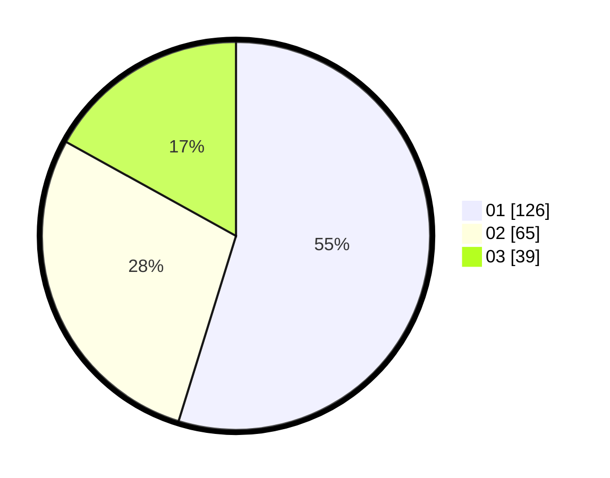

# Hasil

Hasil perolehan suara paslon dapat dilihat pada file paslon-01.txt, paslon-02.txt, dan paslon-03.txt.

Jika tidak ada, artinya data tersebut belum ada pada SIREKAP.

## Perolehan Suara

 * Paslon 01: **126**.
 * Paslon 02: **65**.
 * Paslon 03: **39**.

## Foto C Plano

https://sirekap-obj-formc.kpu.go.id/b039/pemilu/ppwp/31/73/01/10/02/3173011002013-20240216-135307--6140404e-c67f-425e-8f37-711ad7cbd82b.jpg

https://sirekap-obj-formc.kpu.go.id/b039/pemilu/ppwp/31/73/01/10/02/3173011002013-20240216-135308--c7e00742-5c38-4f50-9aa8-9166b643524f.jpg

https://sirekap-obj-formc.kpu.go.id/b039/pemilu/ppwp/31/73/01/10/02/3173011002013-20240216-135308--eeda7b13-c304-4381-b099-793ed4b76252.jpg

## DATA PEMILIH TETAP

Jumlah pemilih dalam DPT: **276**.
 * L: **149**.
 * P: **127**.

## DATA PENGGUNA HAK PILIH

Jumlah pengguna hak pilih dalam DPT: **230**.
 * L: **123**.
 * P: **107**.

Jumlah pengguna hak pilih dalam DPTb: **1**.
 * L: **0**.
 * P: **1**.

Jumlah pengguna hak pilih dalam DPK: **0**.
 * L: **0**.
 * P: **0**.

Jumlah pengguna hak pilih: **231**.
 * L: **123**.
 * P: **108**.

## JUMLAH SUARA SAH DAN TIDAK SAH

JUMLAH SELURUH SUARA SAH: **230**.

JUMLAH SUARA TIDAK SAH: **1**.

JUMLAH SELURUH SUARA SAH DAN SUARA TIDAK SAH: **231**.
