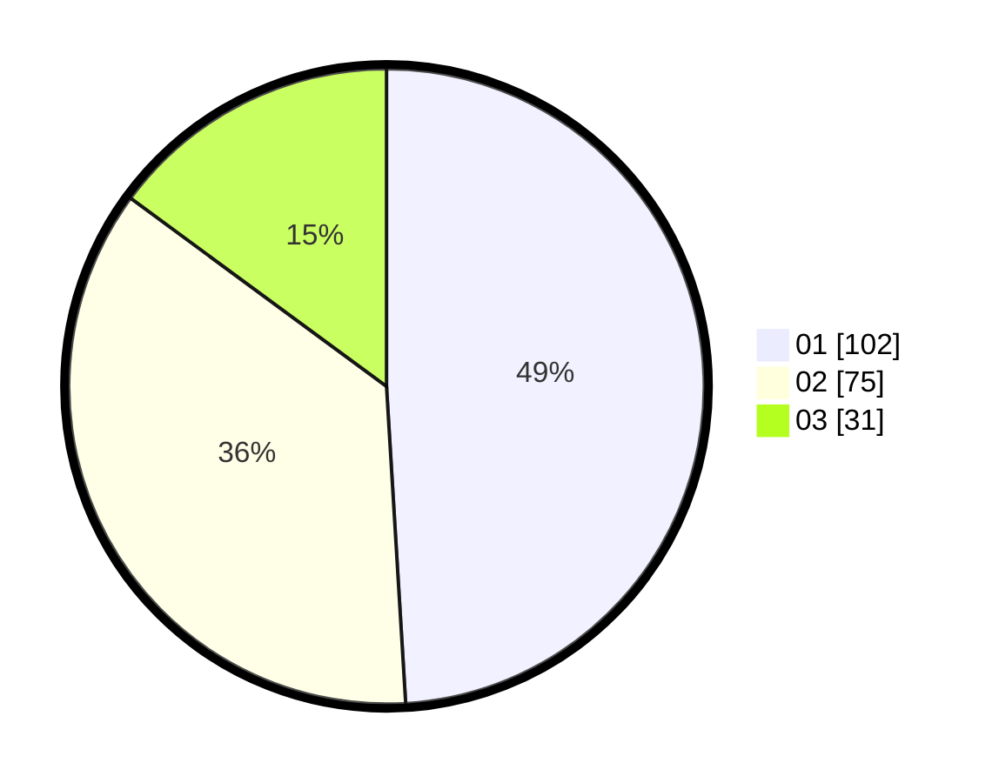

# Hasil

Hasil perolehan suara paslon dapat dilihat pada file paslon-01.txt, paslon-02.txt, dan paslon-03.txt.

Jika tidak ada, artinya data tersebut belum ada pada SIREKAP.

## Perolehan Suara

 * Paslon 01: **102**.
 * Paslon 02: **75**.
 * Paslon 03: **31**.

## Foto C Plano

https://sirekap-obj-formc.kpu.go.id/d8e4/pemilu/ppwp/31/73/01/10/02/3173011002014-20240216-092543--db8e1d9b-86fa-4257-9320-69c9434ca3af.jpg

https://sirekap-obj-formc.kpu.go.id/d8e4/pemilu/ppwp/31/73/01/10/02/3173011002014-20240214-204550--490ea7af-dc6b-4001-b0dd-15b1c92afa69.jpg

https://sirekap-obj-formc.kpu.go.id/d8e4/pemilu/ppwp/31/73/01/10/02/3173011002014-20240214-204608--9a8f0fc4-4f7b-4cf9-bd4c-76bf56d41537.jpg

## DATA PEMILIH TETAP

Jumlah pemilih dalam DPT: **269**.
 * L: **130**.
 * P: **139**.

## DATA PENGGUNA HAK PILIH

Jumlah pengguna hak pilih dalam DPT: **207**.
 * L: **98**.
 * P: **109**.

Jumlah pengguna hak pilih dalam DPTb: **1**.
 * L: **0**.
 * P: **1**.

Jumlah pengguna hak pilih dalam DPK: **1**.
 * L: **0**.
 * P: **1**.

Jumlah pengguna hak pilih: **209**.
 * L: **98**.
 * P: **111**.

## JUMLAH SUARA SAH DAN TIDAK SAH

JUMLAH SELURUH SUARA SAH: **208**.

JUMLAH SUARA TIDAK SAH: **1**.

JUMLAH SELURUH SUARA SAH DAN SUARA TIDAK SAH: **209**.
