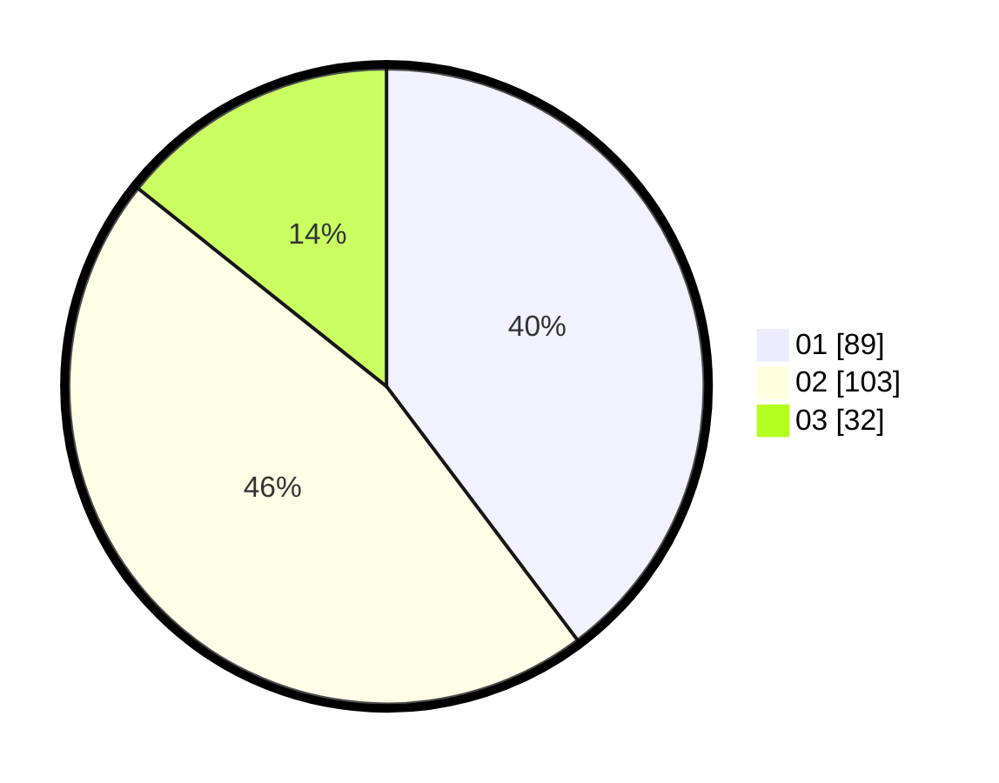

# Hasil

Hasil perolehan suara paslon dapat dilihat pada file paslon-01.txt, paslon-02.txt, dan paslon-03.txt.

Jika tidak ada, artinya data tersebut belum ada pada SIREKAP.

## Perolehan Suara

 * Paslon 01: **89**.
 * Paslon 02: **103**.
 * Paslon 03: **32**.

## Foto C Plano

https://sirekap-obj-formc.kpu.go.id/d051/pemilu/ppwp/31/73/01/10/02/3173011002015-20240215-010432--2b13fdd7-1b8e-4e99-963b-8e97c7936fc5.jpg

https://sirekap-obj-formc.kpu.go.id/d051/pemilu/ppwp/31/73/01/10/02/3173011002015-20240215-010524--b113bb85-a373-4539-b948-7619ca3998b6.jpg

https://sirekap-obj-formc.kpu.go.id/d051/pemilu/ppwp/31/73/01/10/02/3173011002015-20240215-010723--859edb3b-6ad5-4538-a402-a55af72b1efd.jpg
