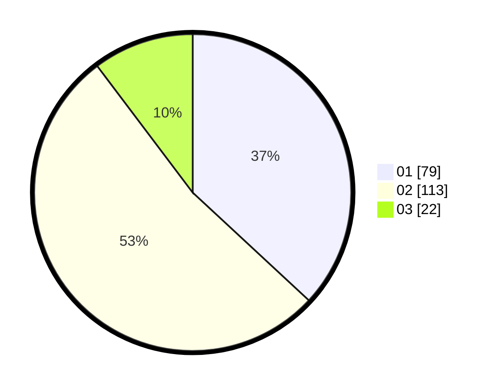

# Hasil

Hasil perolehan suara paslon dapat dilihat pada file paslon-01.txt, paslon-02.txt, dan paslon-03.txt.

Jika tidak ada, artinya data tersebut belum ada pada SIREKAP.

## Perolehan Suara

 * Paslon 01: **79**.
 * Paslon 02: **113**.
 * Paslon 03: **22**.

## Foto C Plano

https://sirekap-obj-formc.kpu.go.id/ab88/pemilu/ppwp/31/73/01/10/02/3173011002018-20240217-201605--91b27979-eec8-4a77-b6dd-f327216c7483.jpg

https://sirekap-obj-formc.kpu.go.id/ab88/pemilu/ppwp/31/73/01/10/02/3173011002018-20240217-201607--7092321a-128d-44aa-84a4-9496558056c7.jpg

https://sirekap-obj-formc.kpu.go.id/ab88/pemilu/ppwp/31/73/01/10/02/3173011002018-20240217-201606--0ec66759-1010-4be3-9bec-c50efbe99f5d.jpg

## DATA PEMILIH TETAP

Jumlah pemilih dalam DPT: **0**.
 * L: **0**.
 * P: **0**.

## DATA PENGGUNA HAK PILIH

Jumlah pengguna hak pilih dalam DPT: **0**.
 * L: **0**.
 * P: **0**.

Jumlah pengguna hak pilih dalam DPTb: **0**.
 * L: **0**.
 * P: **0**.

Jumlah pengguna hak pilih dalam DPK: **0**.
 * L: **0**.
 * P: **0**.

Jumlah pengguna hak pilih: **0**.
 * L: **0**.
 * P: **0**.

## JUMLAH SUARA SAH DAN TIDAK SAH

JUMLAH SELURUH SUARA SAH: **214**.

JUMLAH SUARA TIDAK SAH: **1**.

JUMLAH SELURUH SUARA SAH DAN SUARA TIDAK SAH: **215**.
