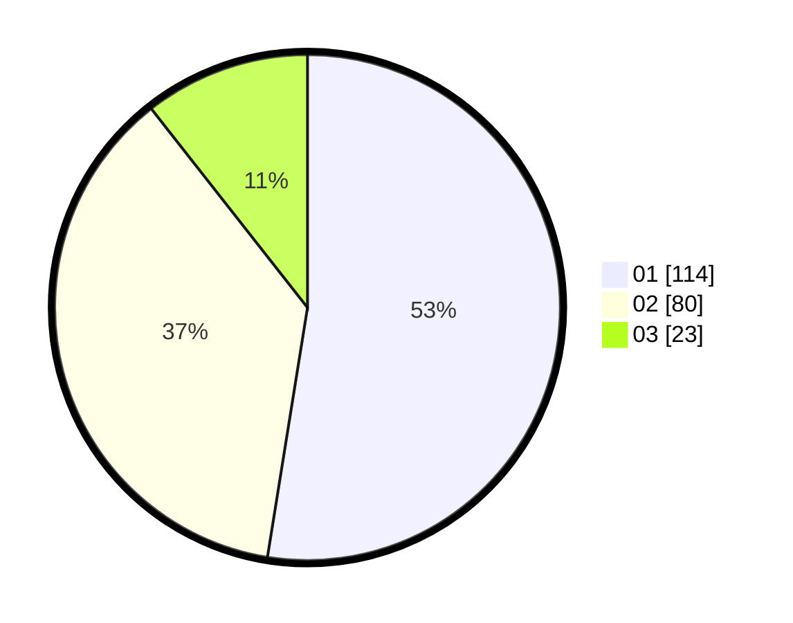

# Hasil

Hasil perolehan suara paslon dapat dilihat pada file paslon-01.txt, paslon-02.txt, dan paslon-03.txt.

Jika tidak ada, artinya data tersebut belum ada pada SIREKAP.

## Perolehan Suara

 * Paslon 01: **114**.
 * Paslon 02: **80**.
 * Paslon 03: **23**.

## Foto C Plano

https://sirekap-obj-formc.kpu.go.id/2cca/pemilu/ppwp/31/73/01/10/02/3173011002021-20240215-123841--d4d3f098-4472-4ebc-a64e-0b495ebe4066.jpg

https://sirekap-obj-formc.kpu.go.id/2cca/pemilu/ppwp/31/73/01/10/02/3173011002021-20240214-223617--670c62c7-e31b-4a58-a433-7de5af08e8bd.jpg

https://sirekap-obj-formc.kpu.go.id/2cca/pemilu/ppwp/31/73/01/10/02/3173011002021-20240214-223701--604b5582-968f-4c87-9c92-9873b9cec094.jpg
