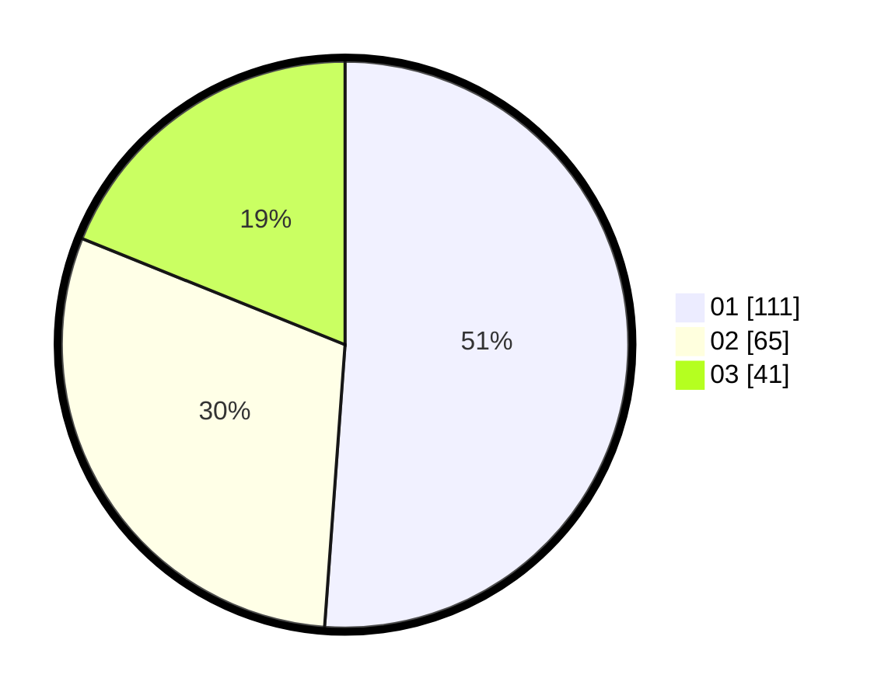

# Hasil

Hasil perolehan suara paslon dapat dilihat pada file paslon-01.txt, paslon-02.txt, dan paslon-03.txt.

Jika tidak ada, artinya data tersebut belum ada pada SIREKAP.

## Perolehan Suara

 * Paslon 01: **111**.
 * Paslon 02: **65**.
 * Paslon 03: **41**.

## Foto C Plano

https://sirekap-obj-formc.kpu.go.id/16ad/pemilu/ppwp/31/73/01/10/02/3173011002023-20240216-142006--70d2ed6a-f260-4baa-846f-7c3070e62443.jpg

https://sirekap-obj-formc.kpu.go.id/16ad/pemilu/ppwp/31/73/01/10/02/3173011002023-20240215-163230--56cc5784-c859-4e9a-a64f-c73c0b5424cb.jpg

https://sirekap-obj-formc.kpu.go.id/16ad/pemilu/ppwp/31/73/01/10/02/3173011002023-20240216-142007--bfbf3460-3273-4b38-9ddd-fa6a1a786a76.jpg

## DATA PEMILIH TETAP

Jumlah pemilih dalam DPT: **266**.
 * L: **144**.
 * P: **122**.

## DATA PENGGUNA HAK PILIH

Jumlah pengguna hak pilih dalam DPT: **216**.
 * L: **113**.
 * P: **103**.

Jumlah pengguna hak pilih dalam DPTb: **3**.
 * L: **3**.
 * P: **0**.

Jumlah pengguna hak pilih dalam DPK: **1**.
 * L: **1**.
 * P: **0**.

Jumlah pengguna hak pilih: **220**.
 * L: **117**.
 * P: **103**.

## JUMLAH SUARA SAH DAN TIDAK SAH

JUMLAH SELURUH SUARA SAH: **217**.

JUMLAH SUARA TIDAK SAH: **3**.

JUMLAH SELURUH SUARA SAH DAN SUARA TIDAK SAH: **220**.
