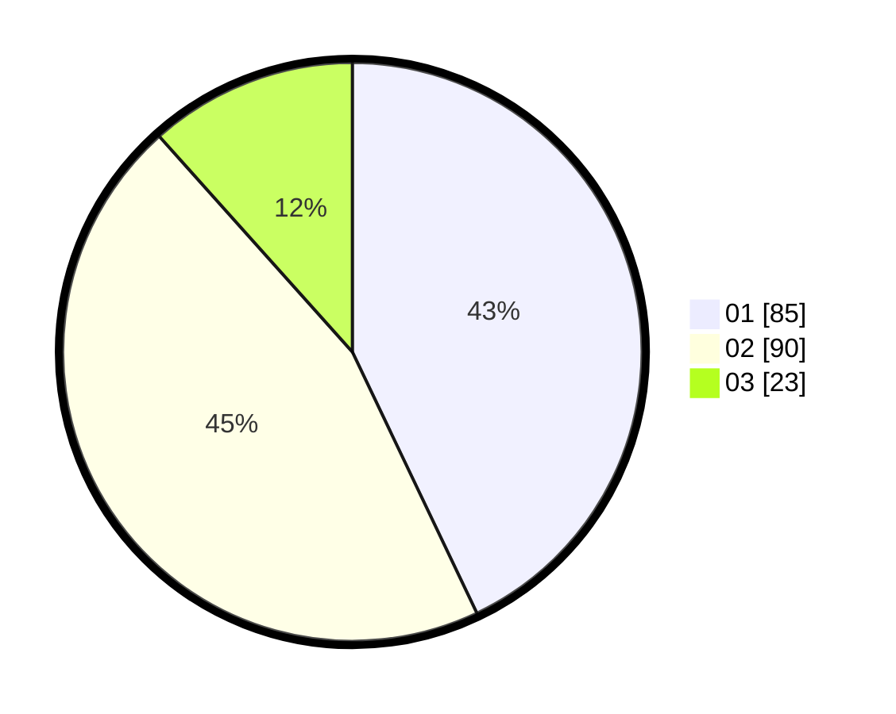

# Hasil

Hasil perolehan suara paslon dapat dilihat pada file paslon-01.txt, paslon-02.txt, dan paslon-03.txt.

Jika tidak ada, artinya data tersebut belum ada pada SIREKAP.

## Perolehan Suara

 * Paslon 01: **85**.
 * Paslon 02: **90**.
 * Paslon 03: **23**.

## Foto C Plano

https://sirekap-obj-formc.kpu.go.id/c75d/pemilu/ppwp/31/73/01/10/02/3173011002032-20240216-152804--6223503a-f040-4e23-80b7-45f9fe651106.jpg

https://sirekap-obj-formc.kpu.go.id/c75d/pemilu/ppwp/31/73/01/10/02/3173011002032-20240216-152805--1cbfc102-fc17-4023-a40b-de514ded607a.jpg

https://sirekap-obj-formc.kpu.go.id/c75d/pemilu/ppwp/31/73/01/10/02/3173011002032-20240216-152804--43d570ad-4c56-41fe-8db7-59c813dba231.jpg

## DATA PEMILIH TETAP

Jumlah pemilih dalam DPT: **276**.
 * L: **136**.
 * P: **140**.

## DATA PENGGUNA HAK PILIH

Jumlah pengguna hak pilih dalam DPT: **201**.
 * L: **94**.
 * P: **107**.

Jumlah pengguna hak pilih dalam DPTb: **0**.
 * L: **0**.
 * P: **0**.

Jumlah pengguna hak pilih dalam DPK: **1**.
 * L: **1**.
 * P: **0**.

Jumlah pengguna hak pilih: **202**.
 * L: **95**.
 * P: **107**.

## JUMLAH SUARA SAH DAN TIDAK SAH

JUMLAH SELURUH SUARA SAH: **198**.

JUMLAH SUARA TIDAK SAH: **4**.

JUMLAH SELURUH SUARA SAH DAN SUARA TIDAK SAH: **202**.
