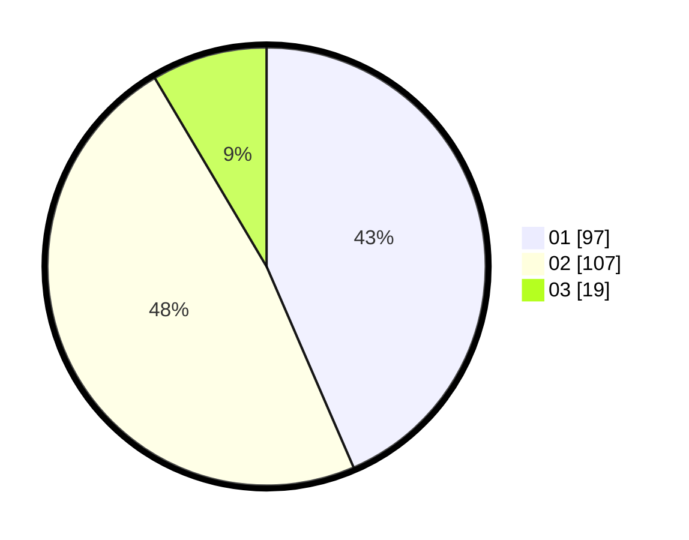

# Hasil

Hasil perolehan suara paslon dapat dilihat pada file paslon-01.txt, paslon-02.txt, dan paslon-03.txt.

Jika tidak ada, artinya data tersebut belum ada pada SIREKAP.

## Perolehan Suara

 * Paslon 01: **97**.
 * Paslon 02: **107**.
 * Paslon 03: **19**.

## Foto C Plano

https://sirekap-obj-formc.kpu.go.id/7c7d/pemilu/ppwp/31/73/01/10/02/3173011002034-20240214-220653--2c70bf47-70bd-49b3-89c2-3953201aba40.jpg

https://sirekap-obj-formc.kpu.go.id/7c7d/pemilu/ppwp/31/73/01/10/02/3173011002034-20240214-222945--41c80a17-bfbf-493b-a99c-1a5f8cadcca5.jpg
