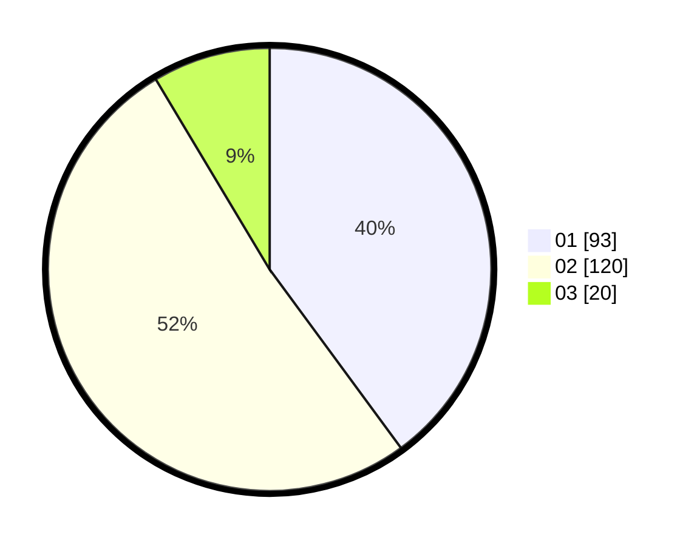

# Hasil

Hasil perolehan suara paslon dapat dilihat pada file paslon-01.txt, paslon-02.txt, dan paslon-03.txt.

Jika tidak ada, artinya data tersebut belum ada pada SIREKAP.

## Perolehan Suara

 * Paslon 01: **93**.
 * Paslon 02: **120**.
 * Paslon 03: **20**.

## Foto C Plano

https://sirekap-obj-formc.kpu.go.id/c9d2/pemilu/ppwp/31/73/01/10/02/3173011002035-20240215-015308--2bf813e1-2426-41c5-b801-aa8333114f9f.jpg

https://sirekap-obj-formc.kpu.go.id/c9d2/pemilu/ppwp/31/73/01/10/02/3173011002035-20240215-034346--877268ec-2244-49ca-886f-6a7ff7927423.jpg
