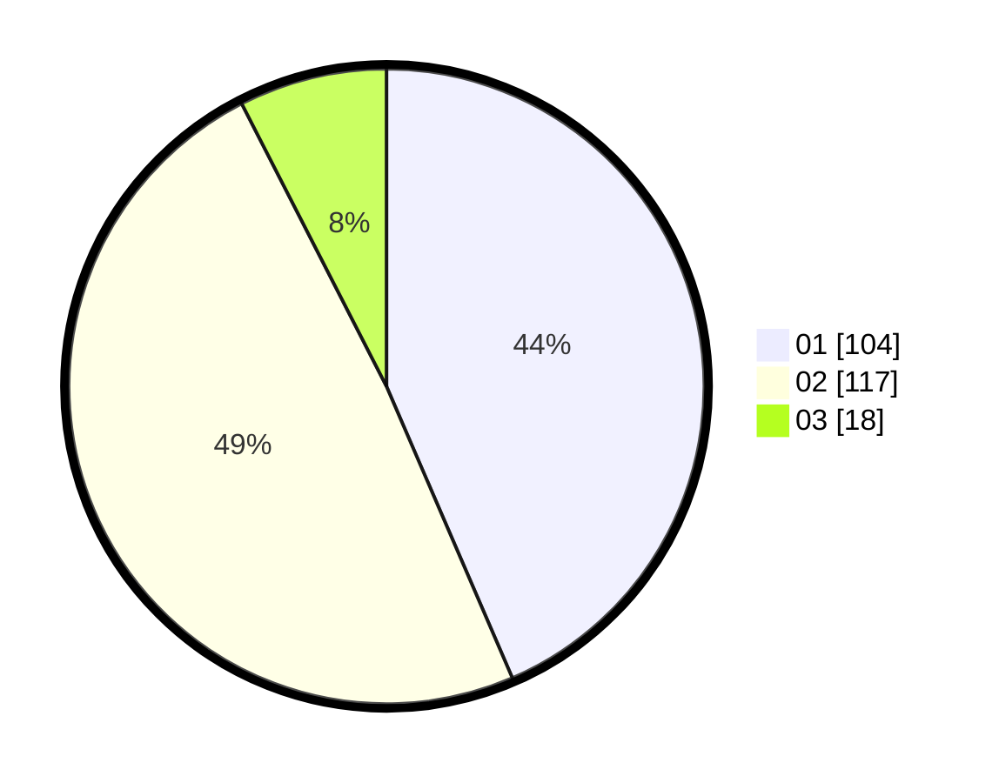

# Hasil

Hasil perolehan suara paslon dapat dilihat pada file paslon-01.txt, paslon-02.txt, dan paslon-03.txt.

Jika tidak ada, artinya data tersebut belum ada pada SIREKAP.

## Perolehan Suara

 * Paslon 01: **104**.
 * Paslon 02: **117**.
 * Paslon 03: **18**.

## Foto C Plano

https://sirekap-obj-formc.kpu.go.id/ca91/pemilu/ppwp/31/73/01/10/02/3173011002038-20240214-223933--d0adc4d2-1e8c-45d2-977c-38a861ad5cbc.jpg

https://sirekap-obj-formc.kpu.go.id/ca91/pemilu/ppwp/31/73/01/10/02/3173011002038-20240214-223146--dadf2948-6253-4fef-8c0b-2658cff0985c.jpg

https://sirekap-obj-formc.kpu.go.id/ca91/pemilu/ppwp/31/73/01/10/02/3173011002038-20240214-223302--ee930096-a1fb-4954-a95a-9c41355865e9.jpg
