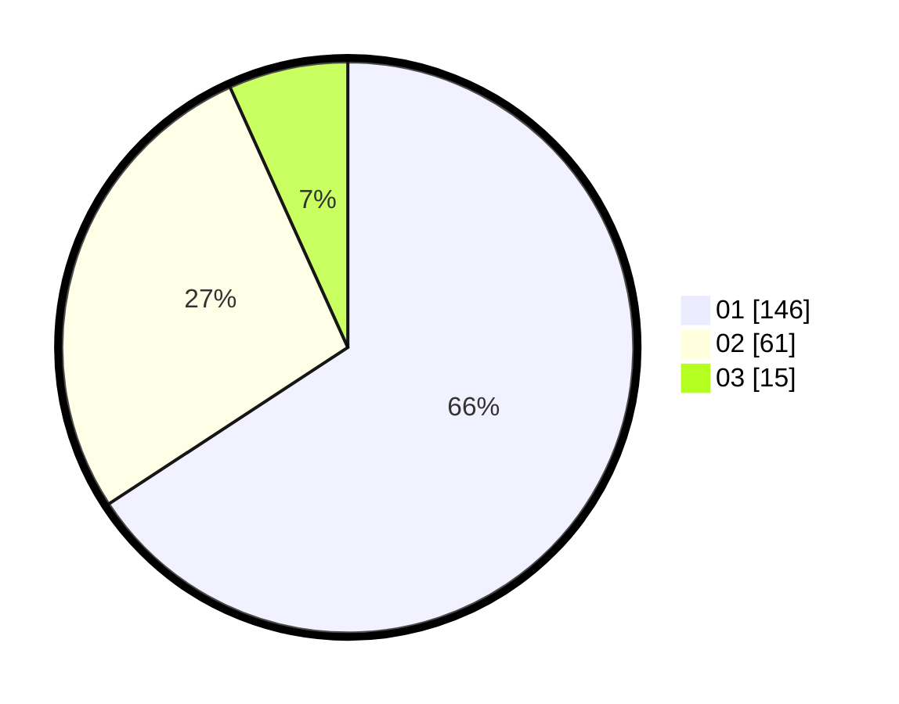

# Hasil

Hasil perolehan suara paslon dapat dilihat pada file paslon-01.txt, paslon-02.txt, dan paslon-03.txt.

Jika tidak ada, artinya data tersebut belum ada pada SIREKAP.

## Perolehan Suara

 * Paslon 01: **146**.
 * Paslon 02: **61**.
 * Paslon 03: **15**.

## Foto C Plano

https://sirekap-obj-formc.kpu.go.id/3650/pemilu/ppwp/31/73/01/10/02/3173011002039-20240216-145450--3d267b0d-4439-4d32-aadb-f109ecc0276a.jpg

https://sirekap-obj-formc.kpu.go.id/3650/pemilu/ppwp/31/73/01/10/02/3173011002039-20240216-145452--eaa48360-f16c-481b-be06-ad098deef55b.jpg

https://sirekap-obj-formc.kpu.go.id/3650/pemilu/ppwp/31/73/01/10/02/3173011002039-20240216-145451--48d63cd8-a15d-447d-8ea0-22bb573e2e31.jpg

## DATA PEMILIH TETAP

Jumlah pemilih dalam DPT: **270**.
 * L: **134**.
 * P: **136**.

## DATA PENGGUNA HAK PILIH

Jumlah pengguna hak pilih dalam DPT: **219**.
 * L: **103**.
 * P: **116**.

Jumlah pengguna hak pilih dalam DPTb: **1**.
 * L: **0**.
 * P: **1**.

Jumlah pengguna hak pilih dalam DPK: **1**.
 * L: **0**.
 * P: **1**.

Jumlah pengguna hak pilih: **221**.
 * L: **103**.
 * P: **118**.

## JUMLAH SUARA SAH DAN TIDAK SAH

JUMLAH SELURUH SUARA SAH: **222**.

JUMLAH SUARA TIDAK SAH: **1**.

JUMLAH SELURUH SUARA SAH DAN SUARA TIDAK SAH: **223**.
