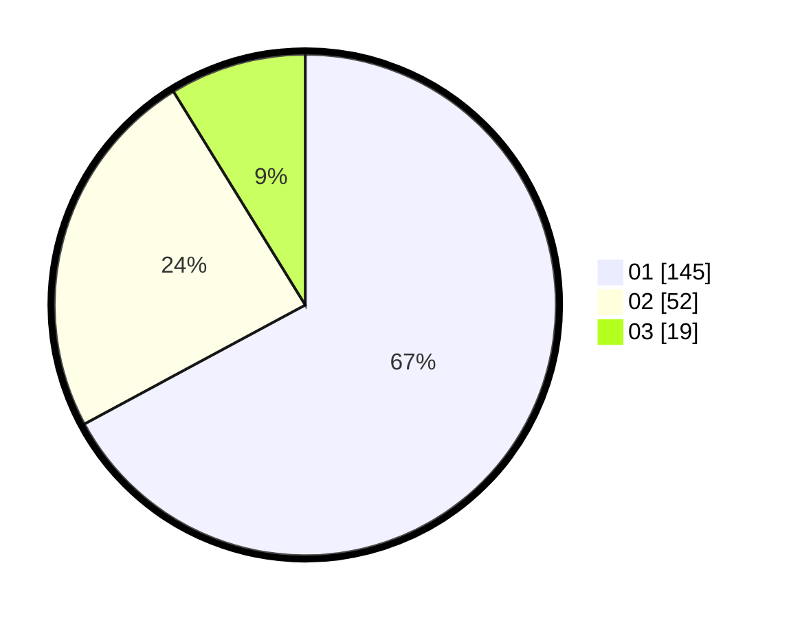

# Hasil

Hasil perolehan suara paslon dapat dilihat pada file paslon-01.txt, paslon-02.txt, dan paslon-03.txt.

Jika tidak ada, artinya data tersebut belum ada pada SIREKAP.

## Perolehan Suara

 * Paslon 01: **145**.
 * Paslon 02: **52**.
 * Paslon 03: **19**.

## Foto C Plano

https://sirekap-obj-formc.kpu.go.id/15e5/pemilu/ppwp/31/73/01/10/02/3173011002041-20240216-151150--6a83f9c8-f2ca-4d79-b2e9-4d06d7b1356e.jpg

https://sirekap-obj-formc.kpu.go.id/15e5/pemilu/ppwp/31/73/01/10/02/3173011002041-20240216-151152--f89b519c-3112-47b2-af93-54bf8140a612.jpg

https://sirekap-obj-formc.kpu.go.id/15e5/pemilu/ppwp/31/73/01/10/02/3173011002041-20240216-151151--da83cfcb-4825-4b85-b65f-beedfabce2a1.jpg

## DATA PEMILIH TETAP

Jumlah pemilih dalam DPT: **217**.
 * L: **106**.
 * P: **111**.

## DATA PENGGUNA HAK PILIH

Jumlah pengguna hak pilih dalam DPT: **217**.
 * L: **106**.
 * P: **111**.

Jumlah pengguna hak pilih dalam DPTb: **2**.
 * L: **1**.
 * P: **1**.

Jumlah pengguna hak pilih dalam DPK: **0**.
 * L: **0**.
 * P: **0**.

Jumlah pengguna hak pilih: **219**.
 * L: **107**.
 * P: **112**.

## JUMLAH SUARA SAH DAN TIDAK SAH

JUMLAH SELURUH SUARA SAH: **216**.

JUMLAH SUARA TIDAK SAH: **3**.

JUMLAH SELURUH SUARA SAH DAN SUARA TIDAK SAH: **219**.
