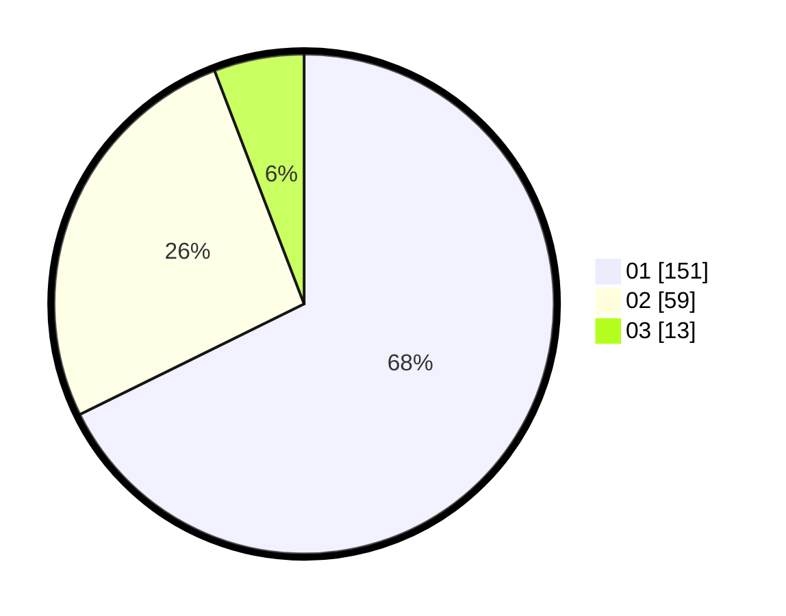

# Hasil

Hasil perolehan suara paslon dapat dilihat pada file paslon-01.txt, paslon-02.txt, dan paslon-03.txt.

Jika tidak ada, artinya data tersebut belum ada pada SIREKAP.

## Perolehan Suara

 * Paslon 01: **151**.
 * Paslon 02: **59**.
 * Paslon 03: **13**.

## Foto C Plano

https://sirekap-obj-formc.kpu.go.id/0868/pemilu/ppwp/31/73/01/10/02/3173011002042-20240214-202743--42fbb135-d95a-4c78-b3a8-676e62a840cc.jpg

https://sirekap-obj-formc.kpu.go.id/0868/pemilu/ppwp/31/73/01/10/02/3173011002042-20240214-203158--096db84d-5b2b-41f6-b6c7-feb43f70a839.jpg

https://sirekap-obj-formc.kpu.go.id/0868/pemilu/ppwp/31/73/01/10/02/3173011002042-20240214-203509--a5d94617-56ee-4928-93fc-cde5435c08db.jpg

## DATA PEMILIH TETAP

Jumlah pemilih dalam DPT: **267**.
 * L: **135**.
 * P: **132**.

## DATA PENGGUNA HAK PILIH

Jumlah pengguna hak pilih dalam DPT: **224**.
 * L: **115**.
 * P: **109**.

Jumlah pengguna hak pilih dalam DPTb: **1**.
 * L: **1**.
 * P: **0**.

Jumlah pengguna hak pilih dalam DPK: **1**.
 * L: **1**.
 * P: **0**.

Jumlah pengguna hak pilih: **226**.
 * L: **117**.
 * P: **109**.

## JUMLAH SUARA SAH DAN TIDAK SAH

JUMLAH SELURUH SUARA SAH: **223**.

JUMLAH SUARA TIDAK SAH: **3**.

JUMLAH SELURUH SUARA SAH DAN SUARA TIDAK SAH: **226**.
