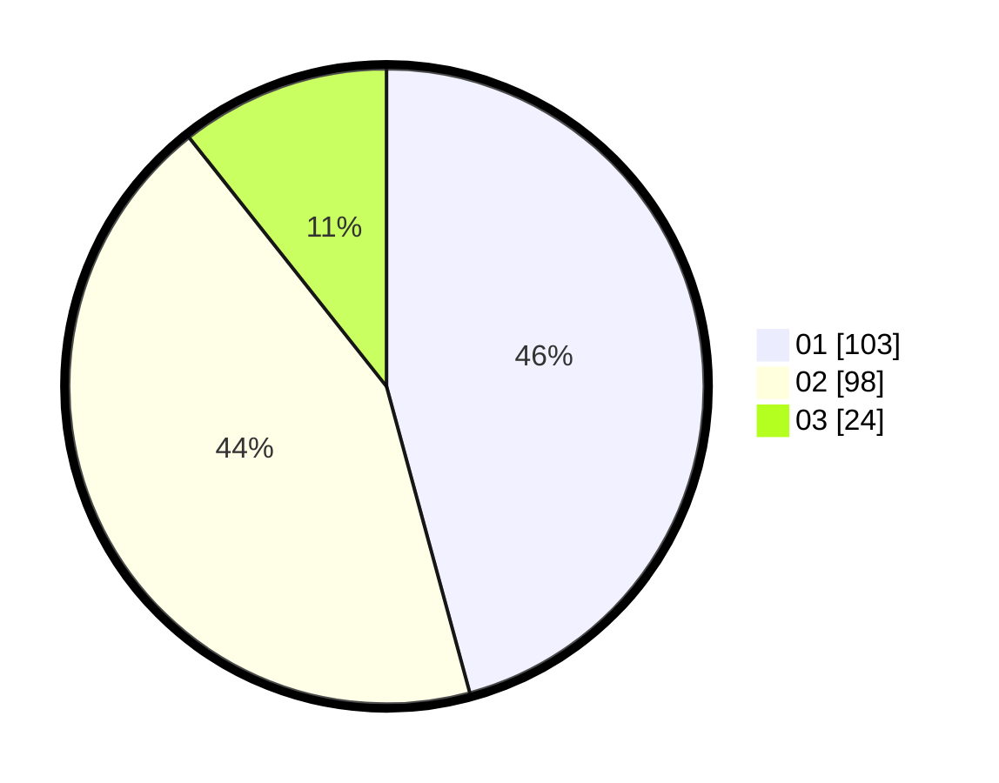

# Hasil

Hasil perolehan suara paslon dapat dilihat pada file paslon-01.txt, paslon-02.txt, dan paslon-03.txt.

Jika tidak ada, artinya data tersebut belum ada pada SIREKAP.

## Perolehan Suara

 * Paslon 01: **103**.
 * Paslon 02: **98**.
 * Paslon 03: **24**.

## Foto C Plano

https://sirekap-obj-formc.kpu.go.id/b1b9/pemilu/ppwp/31/73/01/10/02/3173011002047-20240215-064944--1f40be4e-8203-4168-8023-f70bc12c0bc9.jpg

https://sirekap-obj-formc.kpu.go.id/b1b9/pemilu/ppwp/31/73/01/10/02/3173011002047-20240215-065148--ff748558-9dca-499f-bf76-2f4145553e62.jpg

https://sirekap-obj-formc.kpu.go.id/b1b9/pemilu/ppwp/31/73/01/10/02/3173011002047-20240215-065344--2ef07942-25e3-4e9a-b00f-19b370705a53.jpg
