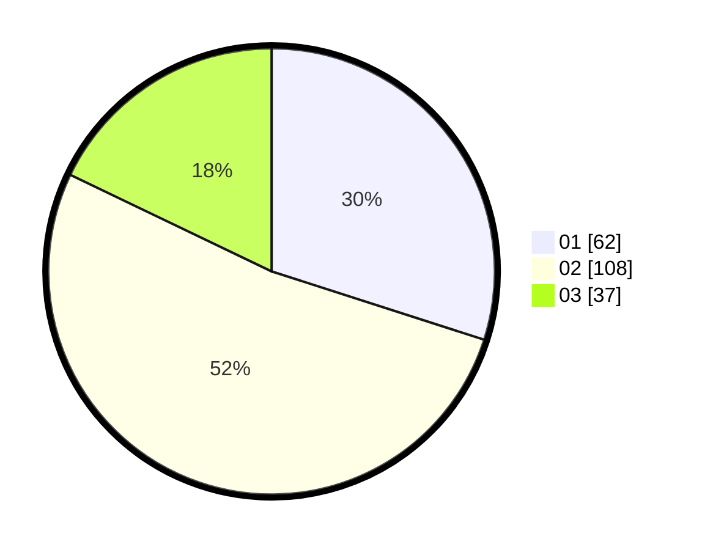

# Hasil

Hasil perolehan suara paslon dapat dilihat pada file paslon-01.txt, paslon-02.txt, dan paslon-03.txt.

Jika tidak ada, artinya data tersebut belum ada pada SIREKAP.

## Perolehan Suara

 * Paslon 01: **62**.
 * Paslon 02: **108**.
 * Paslon 03: **37**.

## Foto C Plano

https://sirekap-obj-formc.kpu.go.id/e202/pemilu/ppwp/31/73/01/10/02/3173011002051-20240215-202017--48b444f6-af9e-4050-bebc-b6e02eca4de7.jpg

https://sirekap-obj-formc.kpu.go.id/e202/pemilu/ppwp/31/73/01/10/02/3173011002051-20240215-141029--5e02f5db-b725-4ae5-9e20-aa50f09a571a.jpg

https://sirekap-obj-formc.kpu.go.id/e202/pemilu/ppwp/31/73/01/10/02/3173011002051-20240215-164808--28a263b6-f2ea-4835-822c-e74c7d2143aa.jpg
