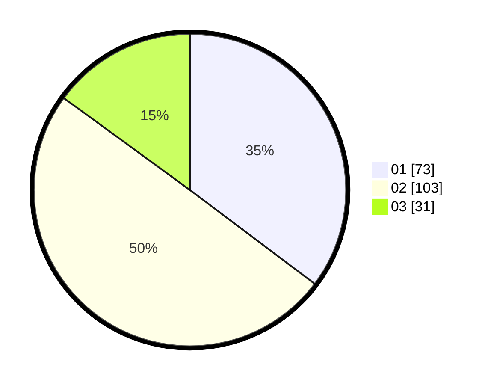

# Hasil

Hasil perolehan suara paslon dapat dilihat pada file paslon-01.txt, paslon-02.txt, dan paslon-03.txt.

Jika tidak ada, artinya data tersebut belum ada pada SIREKAP.

## Perolehan Suara

 * Paslon 01: **73**.
 * Paslon 02: **103**.
 * Paslon 03: **31**.

## Foto C Plano

https://sirekap-obj-formc.kpu.go.id/00aa/pemilu/ppwp/31/73/01/10/02/3173011002053-20240215-053033--c532f393-b608-422b-babc-24499233173b.jpg

https://sirekap-obj-formc.kpu.go.id/00aa/pemilu/ppwp/31/73/01/10/02/3173011002053-20240216-143449--4e5b82fb-2960-4860-93d1-f705dd5ff6fb.jpg

https://sirekap-obj-formc.kpu.go.id/00aa/pemilu/ppwp/31/73/01/10/02/3173011002053-20240216-143448--e568a868-fb23-4dab-9f38-242068204c9b.jpg

## DATA PEMILIH TETAP

Jumlah pemilih dalam DPT: **267**.
 * L: **132**.
 * P: **135**.

## DATA PENGGUNA HAK PILIH

Jumlah pengguna hak pilih dalam DPT: **199**.
 * L: **92**.
 * P: **107**.

Jumlah pengguna hak pilih dalam DPTb: **1**.
 * L: **1**.
 * P: **0**.

Jumlah pengguna hak pilih dalam DPK: **14**.
 * L: **8**.
 * P: **6**.

Jumlah pengguna hak pilih: **214**.
 * L: **101**.
 * P: **113**.

## JUMLAH SUARA SAH DAN TIDAK SAH

JUMLAH SELURUH SUARA SAH: **207**.

JUMLAH SUARA TIDAK SAH: **7**.

JUMLAH SELURUH SUARA SAH DAN SUARA TIDAK SAH: **214**.
