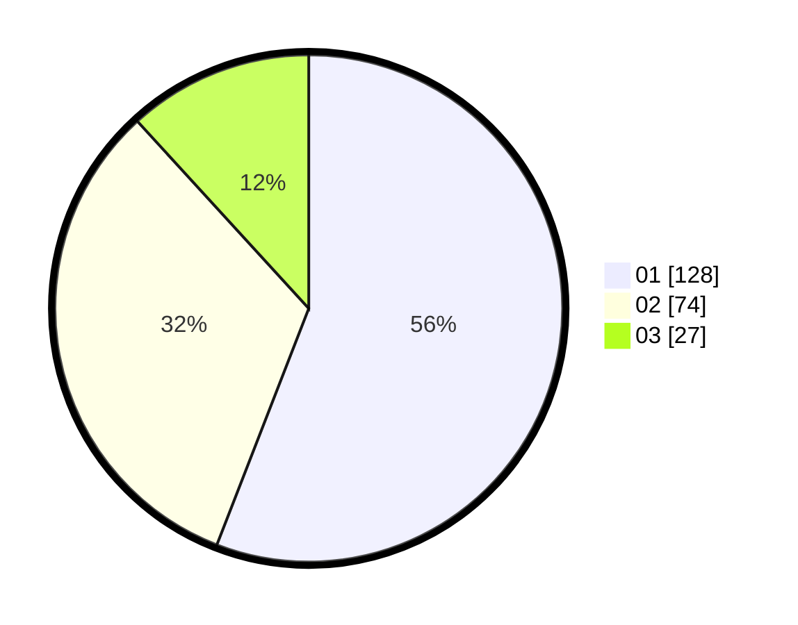

# Hasil

Hasil perolehan suara paslon dapat dilihat pada file paslon-01.txt, paslon-02.txt, dan paslon-03.txt.

Jika tidak ada, artinya data tersebut belum ada pada SIREKAP.

## Perolehan Suara

 * Paslon 01: **128**.
 * Paslon 02: **74**.
 * Paslon 03: **27**.

## Foto C Plano

https://sirekap-obj-formc.kpu.go.id/030e/pemilu/ppwp/31/73/01/10/02/3173011002055-20240215-015214--9595b8ed-17c7-4aa4-b5dc-c7e180c6b3ac.jpg

https://sirekap-obj-formc.kpu.go.id/030e/pemilu/ppwp/31/73/01/10/02/3173011002055-20240215-015243--a3615312-6938-4c02-b2b0-3768ef969667.jpg

https://sirekap-obj-formc.kpu.go.id/030e/pemilu/ppwp/31/73/01/10/02/3173011002055-20240215-015323--25978186-44bf-4d62-af4e-ffa68c36a351.jpg
