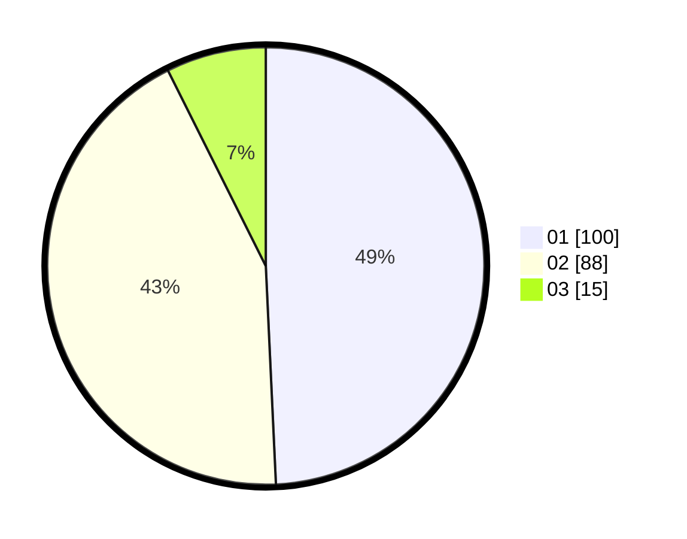

# Hasil

Hasil perolehan suara paslon dapat dilihat pada file paslon-01.txt, paslon-02.txt, dan paslon-03.txt.

Jika tidak ada, artinya data tersebut belum ada pada SIREKAP.

## Perolehan Suara

 * Paslon 01: **100**.
 * Paslon 02: **88**.
 * Paslon 03: **15**.

## Foto C Plano

https://sirekap-obj-formc.kpu.go.id/c7f9/pemilu/ppwp/31/73/01/10/02/3173011002056-20240215-015024--88f0a49a-ff41-4783-b92e-76fa6c7e95f2.jpg

https://sirekap-obj-formc.kpu.go.id/c7f9/pemilu/ppwp/31/73/01/10/02/3173011002056-20240215-015754--70e3c387-c885-42b3-a387-015df91bdb30.jpg

https://sirekap-obj-formc.kpu.go.id/c7f9/pemilu/ppwp/31/73/01/10/02/3173011002056-20240215-015950--7e1d3f94-c3f7-4fb1-9d1c-78b2fdbb11f2.jpg
