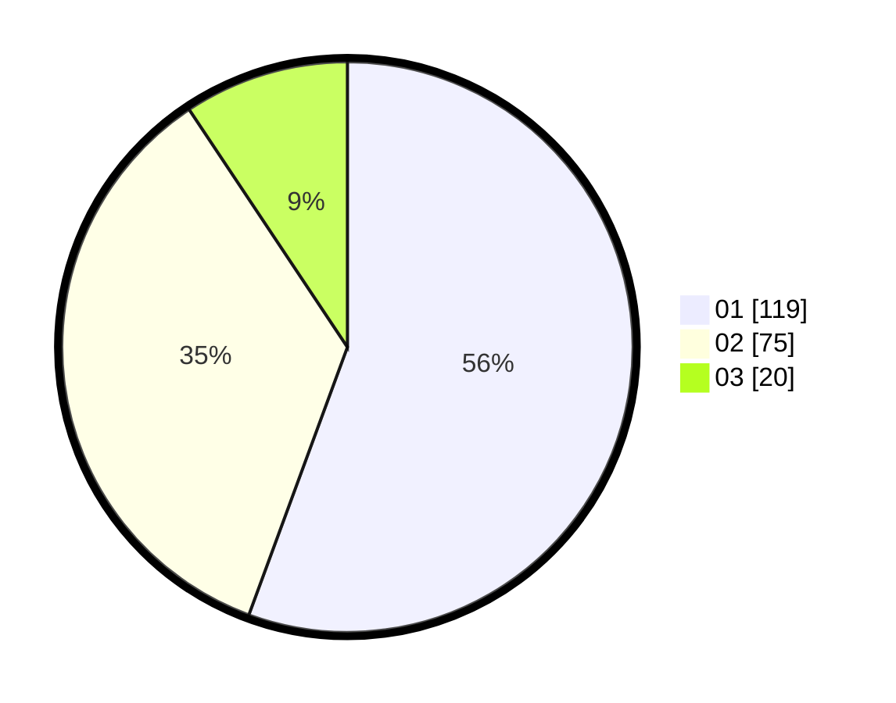

# Hasil

Hasil perolehan suara paslon dapat dilihat pada file paslon-01.txt, paslon-02.txt, dan paslon-03.txt.

Jika tidak ada, artinya data tersebut belum ada pada SIREKAP.

## Perolehan Suara

 * Paslon 01: **119**.
 * Paslon 02: **75**.
 * Paslon 03: **20**.

## Foto C Plano

https://sirekap-obj-formc.kpu.go.id/c245/pemilu/ppwp/31/73/01/10/02/3173011002057-20240216-022721--cbc2973e-b9bc-4401-9b3d-c1b8ad569ed9.jpg

https://sirekap-obj-formc.kpu.go.id/c245/pemilu/ppwp/31/73/01/10/02/3173011002057-20240216-022722--b1dc3388-1239-41a9-b1d0-2483abefe0c9.jpg

https://sirekap-obj-formc.kpu.go.id/c245/pemilu/ppwp/31/73/01/10/02/3173011002057-20240216-022721--b1d167c3-8df6-450e-9030-c9992aedf85a.jpg

## DATA PEMILIH TETAP

Jumlah pemilih dalam DPT: **267**.
 * L: **144**.
 * P: **123**.

## DATA PENGGUNA HAK PILIH

Jumlah pengguna hak pilih dalam DPT: **213**.
 * L: **110**.
 * P: **103**.

Jumlah pengguna hak pilih dalam DPTb: **1**.
 * L: **1**.
 * P: **0**.

Jumlah pengguna hak pilih dalam DPK: **3**.
 * L: **0**.
 * P: **3**.

Jumlah pengguna hak pilih: **217**.
 * L: **111**.
 * P: **106**.

## JUMLAH SUARA SAH DAN TIDAK SAH

JUMLAH SELURUH SUARA SAH: **214**.

JUMLAH SUARA TIDAK SAH: **3**.

JUMLAH SELURUH SUARA SAH DAN SUARA TIDAK SAH: **217**.
