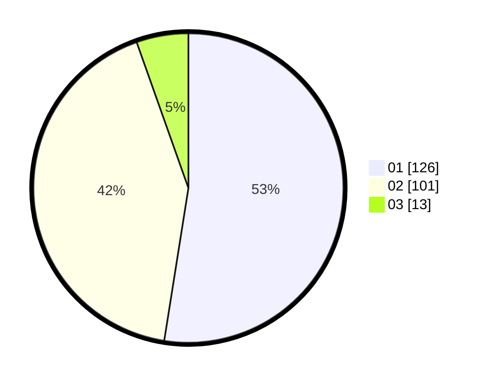

# Hasil

Hasil perolehan suara paslon dapat dilihat pada file paslon-01.txt, paslon-02.txt, dan paslon-03.txt.

Jika tidak ada, artinya data tersebut belum ada pada SIREKAP.

## Perolehan Suara

 * Paslon 01: **126**.
 * Paslon 02: **101**.
 * Paslon 03: **13**.

## Foto C Plano

https://sirekap-obj-formc.kpu.go.id/c921/pemilu/ppwp/31/73/01/10/02/3173011002060-20240216-141446--613d2d46-7255-45f1-b8eb-cd7fcd2292f2.jpg

https://sirekap-obj-formc.kpu.go.id/c921/pemilu/ppwp/31/73/01/10/02/3173011002060-20240216-141447--1580bbb1-2032-4a89-9337-b0ecd7c5d8c4.jpg

https://sirekap-obj-formc.kpu.go.id/c921/pemilu/ppwp/31/73/01/10/02/3173011002060-20240216-141447--79fb84c3-c179-49ec-8857-06107088a232.jpg

## DATA PEMILIH TETAP

Jumlah pemilih dalam DPT: **263**.
 * L: **134**.
 * P: **129**.

## DATA PENGGUNA HAK PILIH

Jumlah pengguna hak pilih dalam DPT: **244**.
 * L: **124**.
 * P: **120**.

Jumlah pengguna hak pilih dalam DPTb: **16**.
 * L: **8**.
 * P: **8**.

Jumlah pengguna hak pilih dalam DPK: **3**.
 * L: **2**.
 * P: **1**.

Jumlah pengguna hak pilih: **263**.
 * L: **134**.
 * P: **129**.

## JUMLAH SUARA SAH DAN TIDAK SAH

JUMLAH SELURUH SUARA SAH: **240**.

JUMLAH SUARA TIDAK SAH: **0**.

JUMLAH SELURUH SUARA SAH DAN SUARA TIDAK SAH: **240**.
