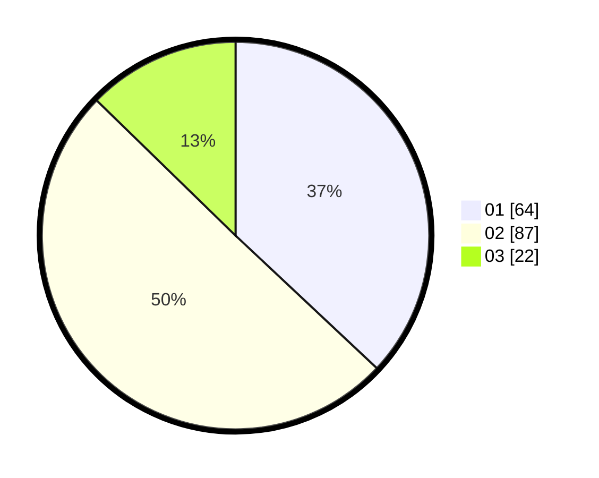

# Hasil

Hasil perolehan suara paslon dapat dilihat pada file paslon-01.txt, paslon-02.txt, dan paslon-03.txt.

Jika tidak ada, artinya data tersebut belum ada pada SIREKAP.

## Perolehan Suara

 * Paslon 01: **64**.
 * Paslon 02: **87**.
 * Paslon 03: **22**.

## Foto C Plano

https://sirekap-obj-formc.kpu.go.id/6289/pemilu/ppwp/31/73/01/10/02/3173011002062-20240214-201914--f2a771f8-7181-4a33-a9a2-c651ce058614.jpg

https://sirekap-obj-formc.kpu.go.id/6289/pemilu/ppwp/31/73/01/10/02/3173011002062-20240214-201949--7fda952e-5ad3-4a0b-bf29-141a9dec762c.jpg

https://sirekap-obj-formc.kpu.go.id/6289/pemilu/ppwp/31/73/01/10/02/3173011002062-20240214-202028--74a2d1af-e707-4b4a-ae18-9ff620e818b1.jpg

## DATA PEMILIH TETAP

Jumlah pemilih dalam DPT: **245**.
 * L: **119**.
 * P: **126**.

## DATA PENGGUNA HAK PILIH

Jumlah pengguna hak pilih dalam DPT: **174**.
 * L: **79**.
 * P: **95**.

Jumlah pengguna hak pilih dalam DPTb: **6**.
 * L: **2**.
 * P: **4**.

Jumlah pengguna hak pilih dalam DPK: **0**.
 * L: **0**.
 * P: **0**.

Jumlah pengguna hak pilih: **180**.
 * L: **81**.
 * P: **99**.

## JUMLAH SUARA SAH DAN TIDAK SAH

JUMLAH SELURUH SUARA SAH: **178**.

JUMLAH SUARA TIDAK SAH: **2**.

JUMLAH SELURUH SUARA SAH DAN SUARA TIDAK SAH: **180**.
