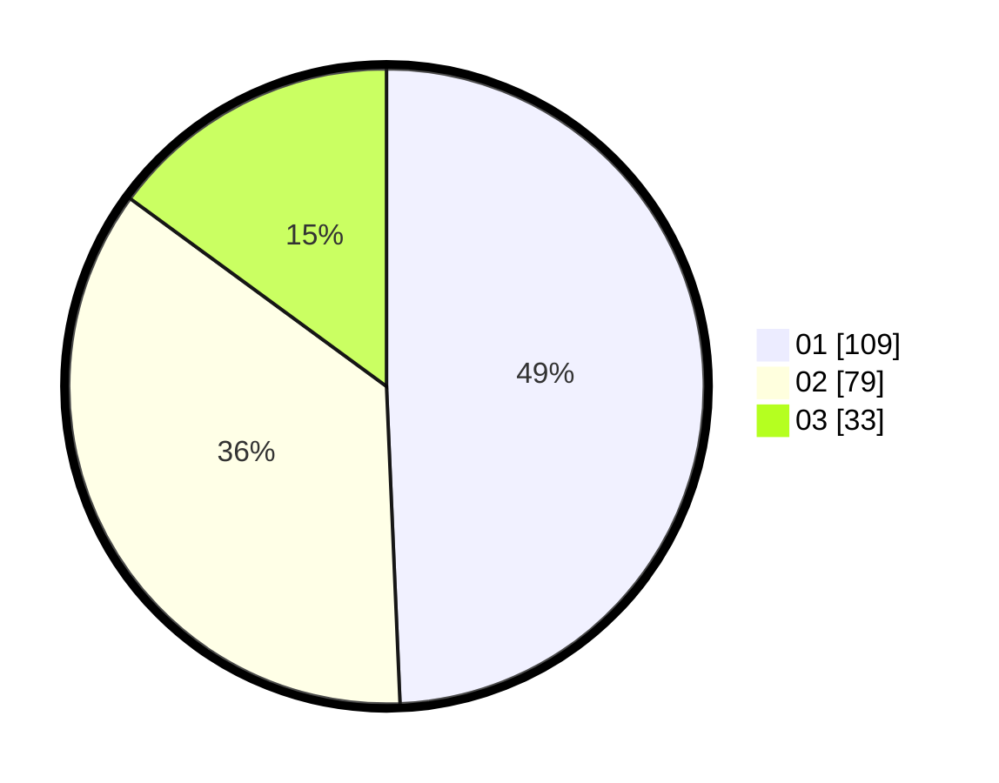

# Hasil

Hasil perolehan suara paslon dapat dilihat pada file paslon-01.txt, paslon-02.txt, dan paslon-03.txt.

Jika tidak ada, artinya data tersebut belum ada pada SIREKAP.

## Perolehan Suara

 * Paslon 01: **109**.
 * Paslon 02: **79**.
 * Paslon 03: **33**.

## Foto C Plano

https://sirekap-obj-formc.kpu.go.id/78a2/pemilu/ppwp/31/73/01/10/02/3173011002063-20240214-205927--38e26799-9329-4a6e-aace-81ff9c3e96f1.jpg

https://sirekap-obj-formc.kpu.go.id/78a2/pemilu/ppwp/31/73/01/10/02/3173011002063-20240214-184927--551c813e-3cb8-43c2-9983-f90f1ab8575b.jpg

https://sirekap-obj-formc.kpu.go.id/78a2/pemilu/ppwp/31/73/01/10/02/3173011002063-20240214-192247--0d1e8cf4-ba41-4a29-bec4-d57540ea2594.jpg

## DATA PEMILIH TETAP

Jumlah pemilih dalam DPT: **270**.
 * L: **133**.
 * P: **137**.

## DATA PENGGUNA HAK PILIH

Jumlah pengguna hak pilih dalam DPT: **270**.
 * L: **133**.
 * P: **137**.

Jumlah pengguna hak pilih dalam DPTb: **4**.
 * L: **2**.
 * P: **2**.

Jumlah pengguna hak pilih dalam DPK: **2**.
 * L: **0**.
 * P: **2**.

Jumlah pengguna hak pilih: **276**.
 * L: **135**.
 * P: **141**.

## JUMLAH SUARA SAH DAN TIDAK SAH

JUMLAH SELURUH SUARA SAH: **222**.

JUMLAH SUARA TIDAK SAH: **2**.

JUMLAH SELURUH SUARA SAH DAN SUARA TIDAK SAH: **222**.
