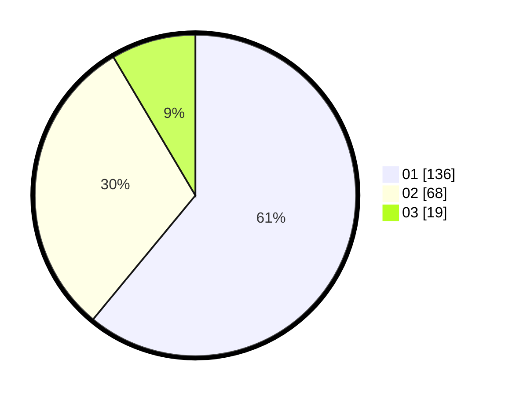

# Hasil

Hasil perolehan suara paslon dapat dilihat pada file paslon-01.txt, paslon-02.txt, dan paslon-03.txt.

Jika tidak ada, artinya data tersebut belum ada pada SIREKAP.

## Perolehan Suara

 * Paslon 01: **136**.
 * Paslon 02: **68**.
 * Paslon 03: **19**.

## Foto C Plano

https://sirekap-obj-formc.kpu.go.id/863f/pemilu/ppwp/31/73/01/10/02/3173011002076-20240215-154448--8845740d-f7b8-427d-97d9-65f486b05406.jpg

https://sirekap-obj-formc.kpu.go.id/863f/pemilu/ppwp/31/73/01/10/02/3173011002076-20240216-142708--aeb3a2b4-dac7-4ad4-a443-4b97bac9746f.jpg

https://sirekap-obj-formc.kpu.go.id/863f/pemilu/ppwp/31/73/01/10/02/3173011002076-20240215-154616--204a9911-2967-4c25-9c3c-af710250c45c.jpg

## DATA PEMILIH TETAP

Jumlah pemilih dalam DPT: **275**.
 * L: **141**.
 * P: **134**.

## DATA PENGGUNA HAK PILIH

Jumlah pengguna hak pilih dalam DPT: **214**.
 * L: **104**.
 * P: **110**.

Jumlah pengguna hak pilih dalam DPTb: **4**.
 * L: **3**.
 * P: **1**.

Jumlah pengguna hak pilih dalam DPK: **5**.
 * L: **1**.
 * P: **4**.

Jumlah pengguna hak pilih: **223**.
 * L: **108**.
 * P: **115**.

## JUMLAH SUARA SAH DAN TIDAK SAH

JUMLAH SELURUH SUARA SAH: **223**.

JUMLAH SUARA TIDAK SAH: **0**.

JUMLAH SELURUH SUARA SAH DAN SUARA TIDAK SAH: **223**.
